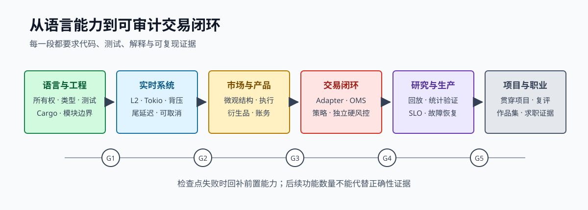

# 第 1 章 路线、环境与第一个交易程序

这一章先回答三个问题：量化交易工程师具体做什么，学习路线如何避免失焦，以及怎样用一个最小 Rust 程序建立工程闭环。

> **学习导航**　前置：基本命令行、编辑器与 Git 概念｜目标：理解岗位能力域，安装工具链并建立编译—测试—lint 闭环｜预计：4–6 小时｜产出：环境基线、首个 crate、能力自评

## 1.1 岗位不是“Rust + 金融名词”

一条自动交易链路至少有六个能力域：

| 能力域 | 需要解决的问题 | 可验证证据 |
| --- | --- | --- |
| Rust 工程 | 所有权、并发、异步、性能、测试 | 类型设计、property test、profile |
| 市场与产品 | 订单簿、撮合、永续、保证金 | 机制推导、产品 fixture |
| 策略与执行 | 公允价、报价、库存、对冲 | 回放结果、成交质量归因 |
| 交易系统 | 行情、OMS、风控、账本、恢复 | 状态机、对账与故障注入 |
| 研究验证 | point-in-time 数据、成本、偏差 | 可重现报告、敏感性分析 |
| 生产运维 | 指标、告警、发布、事故响应 | dashboard、runbook、复盘 |

这些能力不是并列的课程名称，而是一条因果链。行情错了，策略再聪明也没有意义；订单状态错了，PnL 曲线无法证明任何事；回测成交过于乐观，性能优化只是在加速一个错误结论。



*图 1-1：五个阶段检查点把“阅读过”转换成可运行、可解释、可复现的证据。*

## 1.2 四条工程原则

在写第一行代码前，记住四条贯穿全书的原则：

1. **外部世界会部分失败。** TCP 连接正常不代表行情新鲜，请求超时不代表订单失败。
2. **状态必须有权威来源。** 本地投影需要用私有流、REST 查询和对账逐步证实。
3. **资金相关数值不用裸浮点。** 价格、数量和金额需要明确单位、精度、舍入和溢出策略。
4. **性能必须带工作负载和正确性证据。** 吞吐、p99.9、硬件与输入数据缺一不可。

## 1.3 安装工具链

使用 `rustup` 安装 Rust 后检查环境：

```bash
rustc --version
cargo --version
rustup component add rustfmt clippy
```

创建练习项目：

```bash
cargo new trading-lab
cd trading-lab
cargo run
cargo test
cargo clippy --all-targets --all-features -- -D warnings
cargo fmt --check
```

`cargo` 同时负责依赖、构建、测试和运行。日常开发使用 debug build，测性能时使用 `--release`。不要拿 debug build 的延迟下性能结论，也不要只在 release build 中检查正确性。

## 1.4 第一个程序：计算盘口中间价

订单簿顶部给出最高买价 `best_bid` 与最低卖价 `best_ask`。中间价是二者平均：

```text
mid = (best_bid + best_ask) / 2
```

先用整数 tick 表达价格。盘口价差为奇数 tick 时，mid 可能落在半个 tick 上；函数返回“半 tick 数”（真实 mid 需要再除以 2），避免静默向下取整：

```rust
#[derive(Debug, Clone, Copy, PartialEq, Eq, PartialOrd, Ord)]
struct PriceTicks(i64);

fn mid_half_ticks(bid: PriceTicks, ask: PriceTicks) -> Option<i128> {
    if bid.0 <= 0 || ask.0 <= bid.0 {
        return None;
    }

    // 返回 2 * mid_ticks；i128 让 i64 价格极值也能安全相加。
    i128::from(bid.0).checked_add(i128::from(ask.0))
}

fn main() {
    let mid = mid_half_ticks(PriceTicks(6_000_000), PriceTicks(6_000_002));
    assert_eq!(mid, Some(12_000_002)); // 6_000_001 ticks
    assert_eq!(mid_half_ticks(PriceTicks(100), PriceTicks(101)), Some(201)); // 100.5 ticks
}
```

这段小程序已经体现了交易代码的几个习惯：

- `PriceTicks` 阻止价格和普通整数被随意混用。
- 无效或 crossed book 不返回一个看似正常的中间价。
- 半 tick 结果被保留到显示或下单边界，再按产品规则舍入；核心不会静默向下取整。
- `i128` 和 `checked_add` 让极值溢出成为显式失败。
- 返回 `Option`，迫使调用者处理“当前没有可信中间价”。

如果 tick size 是 `0.01`，`6_000_001` ticks 表示 `60_000.01`。转换只发生在配置/API 边界；核心计算保留整数。

## 1.5 从脚本到可验证工程

给函数补测试：

```rust
#[derive(Debug, Clone, Copy, PartialEq, Eq)]
struct PriceTicks(i64);

fn mid_half_ticks(bid: PriceTicks, ask: PriceTicks) -> Option<i128> {
    (bid.0 > 0 && ask.0 > bid.0)
        .then(|| i128::from(bid.0) + i128::from(ask.0))
}

fn main() {}

#[cfg(test)]
mod tests {
    use super::*;

    #[test]
    fn computes_mid_for_valid_book() {
        assert_eq!(
            mid_half_ticks(PriceTicks(100), PriceTicks(102)),
            Some(202)
        );
    }

    #[test]
    fn preserves_a_half_tick_instead_of_rounding_down() {
        assert_eq!(mid_half_ticks(PriceTicks(100), PriceTicks(101)), Some(201));
    }

    #[test]
    fn rejects_crossed_or_locked_book() {
        assert_eq!(mid_half_ticks(PriceTicks(102), PriceTicks(101)), None);
        assert_eq!(mid_half_ticks(PriceTicks(101), PriceTicks(101)), None);
    }
}
```

测试名描述业务行为，不描述实现。以后更换数据结构时，业务契约仍然成立。

## 1.6 建立学习证据目录

建议从第一天就保留以下结构：

```text
trading-lab/
  crates/          可复用 Rust 模块
  fixtures/        录制并脱敏的原始报文
  research/        假设、数据与实验报告
  benchmarks/      固定输入和性能结果
  runbooks/        故障处置步骤
  incidents/       演练或事故复盘
  design/          架构、状态机和决策记录
```

代码仓库不应提交 API key、账户数据或受限市场数据。fixture 要脱敏，密钥只来自 secret manager 或本地安全环境。

## 1.7 起点自评

每项按 0 至 4 分：0 是没接触；1 是能复述；2 是能独立练习；3 是处理过真实边界；4 是能评审设计并指导他人。

- Rust 所有权、trait、错误处理。
- 并发、异步取消和背压。
- profiling 与尾延迟。
- L2 订单簿重建。
- 永续、funding 与保证金。
- 做市、公允价和 inventory skew。
- OMS、对账和恢复。
- 硬风控与 kill switch。
- 事件回放、成交仿真和 PnL 账本。
- 告警、事故响应和技术沟通。

评分不是简历包装工具。它只决定你把时间放在哪里。

## 1.8 一天中的真实工作是什么

“量化交易工程师”在不同团队里含义差异很大。偏研究的平台岗位可能花更多时间建设数据和回测；偏执行的岗位会深入订单生命周期与成本；偏低延迟的岗位则关注网络路径、内存布局和部署拓扑。但一个完整工作日通常会在下面几类活动之间切换。

早盘前，工程师检查 overnight 运行状态：行情缺口、私有流重连、未决订单、权益变化和 funding 是否已经对账。这里的目标不是看服务是否存活，而是确认系统对外部世界的认识仍然可信。

交易时段内，工程师可能收到“成交率下降”的反馈。一个不成熟的响应是立刻把报价调得更激进；成熟的调查会先拆分：

1. 订单有没有成功到达 venue，reject 和 rate limit 是否变化？
2. 报价相对 fair value、best price 和 queue 的位置是否变化？
3. 市场的 spread、depth、trade flow 是否进入新 regime？
4. fill 下降是否伴随 markout 改善，也就是少成交的其实是坏订单？
5. 策略参数、fee tier、latency 或 venue 规则最近是否变更？

盘后则需要把研究与生产事实连接起来：真实 fill、延迟、费用和持仓路径与模拟有何差异，模型应该怎样校准，哪些差异代表实现 bug，哪些只是不可避免的不确定性。

这说明岗位的核心产物不只有代码。你还会维护规则表、数据 schema、基准报告、dashboard、runbook、事故复盘和研究结论。书中要求保留这些证据，是为了贴近真实协作，而不是增加形式工作。

## 1.9 从需求到证据的一次小迭代

假设交易员提出需求：“行情超过 200 ms 就停止报价。”不要直接在策略中写一个常数。先把含糊需求展开：

```text
输入是什么：最后一条 byte、消息、有效 book update，还是完整 resync 时间？
使用哪个时钟：本地 monotonic duration 还是 exchange timestamp？
影响范围：单 instrument、venue 还是整个策略？
停止是什么：停止 new、撤活动订单，还是主动降仓？
撤单失败怎么办：是否继续计算最坏暴露并告警？
恢复条件：收到一条消息就恢复，还是重新同步并稳定一段时间？
```

得到规格后，再把它分成可测试的部分：

- `age = now_monotonic - last_valid_book_receive`。
- age 超过 soft limit 时 resize/widen。
- 超过 hard limit 时 risk-off 并产生 cancel action。
- 新 snapshot 对齐、checksum 通过且 age 稳定后进入 `ReadyForApproval`。
- 恢复交易需要显式 enable，不能由一条行情自动打开。

最后定义证据：fake clock 的单元测试、断流 fixture、risk decision 日志、告警截图和一次演练记录。这个流程适用于全书所有需求：先明确事实和风险，再写状态与不变量，最后决定实现。

## 1.10 如何阅读代码和官方文档

学习交易接入时，资料优先级应是：

1. 交易所官方产品与 API 文档，决定当前协议事实。
2. 录制的真实 payload、账户记录和最小实验，验证文档理解。
3. 教材和论文，解释一般机制与模型。
4. 开源框架和 SDK，学习实现方式但审计其边界。
5. 博客和视频，用于建立直觉，不作为生产规则依据。

官方文档也会过期或含糊，因此每条重要规则都应记录产品、文档标题、访问日期、样例 payload 和对应测试。看到 `post_only`、`reduce_only`、`trade_id` 这类熟悉名称时尤其要警惕：名字相同并不保证行为、唯一性作用域和失败语义相同。

阅读 Rust 库时，则重点检查：维护状态、许可证、unsafe 面积、错误类型、取消安全、背压方式、依赖体积与 benchmark 是否可复现。交易所 SDK 可以加快探索，但不能替你决定重试、精度、状态恢复和资产安全。

## 1.11 本章练习

1. 为 `PriceTicks` 增加安全的 `spread` 函数，并覆盖负价、locked、crossed 和极大整数。
2. 假设 tick size 为 `0.05`，设计字符串 `"100.10"` 到 ticks 的严格转换规格。先写规则，不急着实现。
3. 在自己的仓库记录 Rust 版本、操作系统与 CPU，为后续 benchmark 建立环境基线。
4. 完成上面的自评，每个非零分附一条证据。

本章完成标准：能独立创建、测试和 lint 一个 Rust 项目，并能解释为什么最小示例没有直接使用 `f64`。
