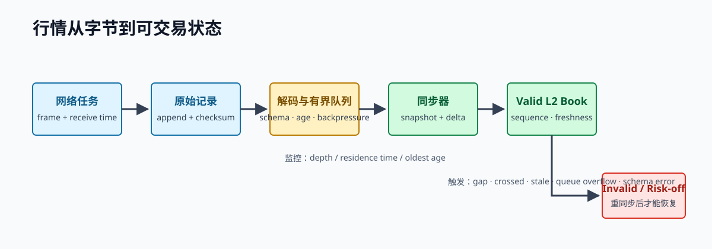

# 第 10 章 并发、异步与背压

实时系统不是“把所有函数改成 async”。它需要明确状态所有权、消息可靠性、队列容量、过载动作和取消后的外部副作用。

> **学习导航**　前置：第 3、7、9 章的所有权、trait 与状态不变量｜目标：区分线程/task，设计有界队列、取消和受监督关闭｜预计：10–12 小时｜产出：bounded pipeline、满载策略表和 timeout/shutdown 时间线

> **章节边界：** 本章处理与 transport 无关的并发语义：状态归谁、消息是否可丢、容量如何推导、取消后副作用如何收敛。第 11 章才把这些约束用于 TCP/HTTP/WebSocket、heartbeat 与重连；两章都出现 timeout 和 `select!`，前者解释风险语义，后者解释连接实现。

## 10.1 线程、任务与并发

OS 线程由内核调度，适合 CPU 工作或需要明确隔离的执行循环。异步 task 是由 runtime 调度的 Future，适合大量等待网络 I/O 的连接。Tokio task 不是线程；在 runtime worker 上做阻塞文件 I/O、压缩或长计算，会拖延同一 worker 的其他任务。

常见分层：

```text
network task -> decoder -> bounded queue -> single-writer engine
                                         -> book/signal/risk/OMS
private stream + REST -------------------> OMS/reconciliation
```



*图 10-1：有界队列不仅限制内存，也让消息年龄和失效动作成为显式契约。*

## 10.2 `Send`、`Sync` 与共享

- `T: Send` 表示 `T` 的所有权可以安全地移动到另一线程。
- `T: Sync` 表示 `&T` 可以安全地在线程间共享。
- `Arc<T>` 提供线程安全引用计数，但 `T` 仍需满足相应并发约束。

优先通过消息传递把事件送给状态所有者。只有确实需要共享访问时，才选择 `Mutex`、`RwLock` 或 atomic，并写明同步不变量。

## 10.3 有界队列是风险控制

无界队列不会消除过载，只会把它变成不断增长的内存和数据年龄。有界队列迫使系统定义满载行为。

标准库的同步通道可以演示背压：

```rust
use std::sync::mpsc::sync_channel;
use std::thread;

fn main() {
    let (tx, rx) = sync_channel::<u64>(2);
    let producer = thread::spawn(move || {
        for sequence in 1..=3 {
            tx.send(sequence).expect("consumer is alive");
        }
    });

    let collected: Vec<_> = rx.iter().take(3).collect();
    producer.join().expect("producer panicked");
    assert_eq!(collected, vec![1, 2, 3]);
}
```

容量不应来自随手写的常数。粗略估计需要：峰值输入速率、处理速率、允许 burst 持续时间、每条消息大小和最大可接受 age。即使容量合理，持续过载仍必须降级。

## 10.4 不同消息有不同过载策略

| 对象 | 队列满时的候选动作 | 不能默认做什么 |
| --- | --- | --- |
| 订单簿增量 | 标记 book invalid，触发重同步 | 任意丢一个后继续发布 |
| 可替代特征 | 合并成最新版本，记录丢弃数 | 无限排队旧信号 |
| 订单/成交 | 可靠处理或 risk-off | 丢弃、覆盖、任意重排 |
| debug 日志 | 采样、异步写、统计丢弃 | 阻塞交易循环 |
| 风控告警 | 独立高优先级通道 | 静默丢失 |

“drop oldest”不是通用答案。行情 delta 与最终状态 snapshot 的可替代性完全不同。

## 10.5 Future 是惰性的状态机

调用 `async fn` 只创建 Future；runtime poll 它时才推进。Future 在等待点让出执行权，局部状态保存在生成的状态机中。`Pin` 解决某些 Future 自引用后不能移动的问题；多数业务代码使用 `.await` 即可，但要理解库的取消语义。

一个典型 Tokio 结构如下，代码需要项目依赖 `tokio`：

```rust,ignore
use tokio::sync::mpsc;

#[derive(Debug)]
struct MarketEvent {
    sequence: u64,
}

#[tokio::main]
async fn main() {
    let (tx, mut rx) = mpsc::channel::<MarketEvent>(1024);

    let producer = tokio::spawn(async move {
        tx.send(MarketEvent { sequence: 1 }).await?;
        Ok::<_, mpsc::error::SendError<MarketEvent>>(())
    });

    while let Some(event) = rx.recv().await {
        println!("{}", event.sequence);
    }

    producer.await.unwrap().unwrap();
}
```

生产代码不能用示例里的 `unwrap()` 处理 task panic、channel 关闭或连接失败，需要把关闭原因映射到健康状态和风险动作。

## 10.6 Timeout 不等于远端失败

下单过程可能发生：

```text
本地发送 -> 交易所接受并挂单 -> 响应在网络中丢失 -> 本地 timeout
```

此时本地不能标记 `Rejected`，也不能用新 client ID 盲目重发。正确动作是：

1. 发送前持久化 intent 与稳定唯一的 client order ID。
2. timeout 后标记 `Uncertain`。
3. 将潜在订单计入 worst-case exposure。
4. 通过 client ID、open orders、recent fills 对账。
5. 超过不确定状态时限则停止增险并升级。

Rust 的取消安全只描述 Future 被停止时本地状态是否可安全重试，不会撤销远端副作用。

## 10.7 `select!` 与取消

在 `select!` 中，一个分支完成后，其他分支 Future 通常被 drop。对 socket read，重新调用可能安全；对“发送订单并等待响应”的组合操作，drop 可能留下未知远端状态。

设计时把外部副作用拆成可审计阶段：

```text
IntentCreated(durable)
  -> SendAttempted
  -> Acked | Rejected | Uncertain
```

状态转换和网络动作分开。纯 reducer 决定下一状态与 action，执行器完成副作用并产生新事件。这种结构更容易 replay 和故障注入。

## 10.8 Graceful shutdown 的正确顺序

关闭交易系统不是立刻退出进程：

1. 禁止产生新的增险意图。
2. 使策略进入 risk-off，并按能力尝试撤活动订单。
3. 继续处理私有事件和 fill，直到订单状态确认或进入人工处置。
4. 对账订单、持仓和余额。
5. 刷新关键审计记录，再关闭连接和进程。

撤单请求发出不代表订单已撤。shutdown 超时后也要留下明确的未知状态与接管步骤。

## 10.9 Atomics 的边界

atomic 适合简单计数、标志和可证明的无锁协议。Acquire/Release 描述跨线程可见性的同步关系，不是性能装饰。复杂订单状态通常更适合由单写者或锁保护；使用 lock-free 前要说明线性化点、ABA、内存回收和每种内存序的证明。

## 10.10 并发测试

至少做三类实验：

- producer 以 consumer 两倍速率运行，比较 unbounded、bounded block 和 coalesce 的内存、age 与正确性。
- 在发送、落盘和状态更新之间随机取消，验证不会出现无本地记录的潜在订单。
- 正常、日志暴增、CPU 干扰和队列积压下运行相同负载，观察 p99.9 与 risk-off 是否及时。

小型并发协议可以用模型测试穷举交错；外部系统则用确定性事件序列和故障注入验证。

## 10.11 队列容量怎样推导

假设正常行情速率是每秒 20,000 条，极端 burst 达到每秒 80,000 条并持续 250 ms；consumer 稳定处理能力是每秒 50,000 条。burst 期间净积压：

```text
(80,000 - 50,000) events/s * 0.25 s = 7,500 events
```

如果每个 owned event 连同分配平均占 160 bytes，仅净积压约 1.2 MB。考虑调度抖动和测量误差后，容量可能取 10,000 或 16,384，但这只是内存约束的一部分。

更关键的是 age。burst 结束时，7,500 条积压按每秒 50,000 条处理，需要约 150 ms 才能清空。如果策略 horizon 只有 100 ms，即使队列没有满，数据已经失去交易价值。系统应监控最老消息 age，并在硬阈值前 resize/risk-off，而不只是看 `len/capacity`。

如果输入长期为 60,000/s 而 consumer 只有 50,000/s，任何有限容量最终都会满。此时答案不是继续增大 channel，而是提高服务率、减少输入、对可替代数据 coalesce，或停止依赖该链路交易。

## 10.12 任务树与生命周期

随意 `spawn` 的后台任务很容易变成孤儿：父组件重连后旧 heartbeat 仍在运行，shutdown 时 recorder 尚未 flush，错误只打印日志而没有传回 supervisor。

把任务组织成生命周期树：

```text
Application supervisor
  Venue supervisor
    Public connection task
      read loop
      heartbeat loop
    Private connection task
    Reconciliation task
  Engine task
  Persistence task
  Metrics/export task
```

父节点负责：启动子任务、接收致命错误、发出 cancellation、等待 join、汇总未完成状态。任何 task 的退出都应该区分 expected shutdown、retryable disconnect、auth failure、invariant violation 和 panic。

取消信号之后仍要等待资源收敛。一个实用顺序是：关闭新 intent 输入，等待 engine 处理已接收事件，发出撤单/对账 action，刷新持久化，再关闭 recorder 和连接。为每个阶段设置期限；超时不等于成功，而是升级为显式未完成状态。

## 10.13 一次背压事故的因果链

考虑这样的事故：debug 日志临时提高到每条行情一条，异步日志 channel 无界。开始时服务正常，十分钟后内存上升，allocator 和内核回收消耗 CPU，market-data queue age 变大，策略使用旧 book，撤单决策也延迟，最终出现一批不利成交。

如果只看 CPU，可能误判为解析性能回退。完整因果证据应该包含：

```text
log producer rate > sink rate
-> log queue bytes/age 上升
-> allocation 与 RSS 上升
-> scheduler/allocator 抖动
-> engine queue residence p99.9 上升
-> quote age 与 negative markout 上升
```

永久修复不是“以后不要开 debug”，而是：日志 channel 有界、按 reason/venue 采样、记录 dropped log count、禁止高频路径同步格式化大 payload，并让 queue age 超限触发交易降级。演练时重新制造 sink 变慢，验证风险动作先于内存失控。

## 10.14 本章练习

1. 用 bounded channel 构建 producer/consumer，记录 queue depth 和 residence time。
2. 分别为 order book delta、signal snapshot、fill 和日志写出满载策略。
3. 画出一次下单 timeout 的事件时间线，标出每个时点的本地事实和远端未知。
4. 为服务定义 shutdown 超时后的人工接管信息。

本章完成标准：能解释每条 channel 的容量与满载行为，能区分 task 取消和远端操作撤销，并能在过载时优先限制资金风险。
