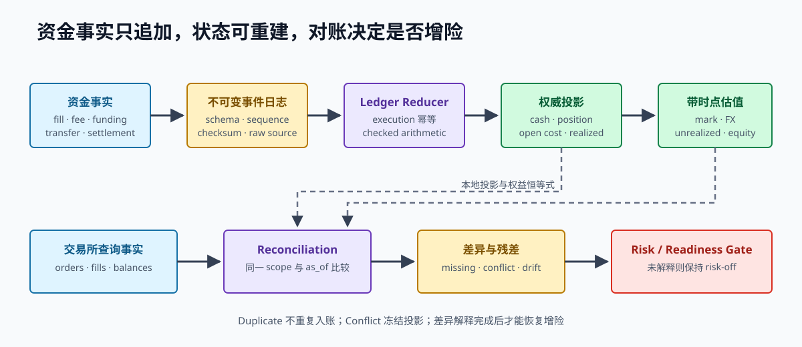

# 第 17 章 交易账本、幂等与对账

策略可以算错，行情可以中断，订单响应可以丢失，但已经发生的资金事实不能因为重放、重启或乱序而改变第二次。本章把第 15、16 章的产品公式落实为一个可运行账本，并明确它与 OMS、交易所账单及分析归因的边界。

> **学习导航**　前置：第 6、15、16 章的领域类型、产品现金流与会计恒等式｜目标：构建 execution 幂等、精度明确、可重放和可对账的交易账本｜预计：12–16 小时｜产出：average-cost ledger、golden cash-flow fixture、reconciliation report 和重放 checksum

## 17.1 账本不等于仓位变量

下面的写法无法回答资金系统最基本的问题：

~~~text
position += signed_fill_qty
pnl += guessed_profit
~~~

它没有记录哪笔 execution 改变了状态、费用从哪个币种扣除、使用什么成本法、估值价格来自哪里，也无法判断重放后是否重复入账。可信账本至少分开：

- 不可变输入事实：execution、fee、funding、transfer、settlement。
- 权威投影：cash、position、open cost、realized PnL。
- 带时间的估值：mark、FX、unrealized PnL、equity。
- 分析视图：spread capture、markout、inventory 与 hedge attribution。

分析视图可以重算，不能反向修改资金事实。

## 17.2 先固定核算范围与单位

在写 reducer 前回答：

1. 账户范围是单 venue 子账户，还是跨 venue 组合？
2. 每个 cash balance 的币种是什么？
3. price ticks 乘 qty lots 如何通过 tick value、lot value 和 multiplier 变成结算金额？
4. fee、funding 和 collateral haircut 使用什么精度与舍入？
5. equity 使用哪个 mark 与 FX source，在什么时刻取值？

配套实现采用教学单位：

~~~text
notional_quote = price_ticks * qty_lots
fee_quote      = 非负整数 quote unit
~~~

这足以证明状态算法，不足以直接接真实产品。扩展时应让 instrument metadata 提供转换规则，而不是在账本里按 symbol 猜测。

## 17.3 Execution 身份是第一道边界

同一个交易所数字 ID 未必全局唯一。一个 execution key 通常至少包含：

~~~text
(venue, account, instrument, execution_id)
~~~

处理重复 key 时要比较完整事实：

- key 和 side/price/qty/fee 都相同：幂等重放，返回 Duplicate。
- key 相同但任一事实不同：数据冲突，停止投影并对账。

第二种情况不能安静地“以第一条为准”，因为它可能来自 adapter 作用域错误、venue correction、日志损坏或账户串线。

## 17.4 Cash 与 Position 同时更新

在线性教学口径中，买卖现金流为：

~~~text
Buy:  cash -= price * qty + fee; position += qty
Sell: cash += price * qty - fee; position -= qty
~~~

一次 fill 的 cash、position、cost basis 和 execution index 必须属于同一个提交边界。如果 cash 已扣而 position 更新溢出，状态不能停在中间。配套 Ledger::apply_fill 先在候选状态上完成全部 checked arithmetic，成功后才整体替换当前状态。

内存 clone 只是教学事务。持久化版本通常先追加带 checksum 的不可变事件，再更新可重建投影；不能把四张数据库表的“尽量同时写”当成精确一次。

## 17.5 Average Cost 的方向规则

同方向增加仓位时，把新 notional 加入 open cost。反方向成交时，先关闭已有仓位：

~~~text
average_cost = open_cost / abs(position)
closed_cost  = average_cost * close_qty

long realized  = exit_notional - closed_cost
short realized = closed_cost - exit_notional
~~~

若 fill 大于已有仓位，先把旧仓位全部关闭，再以剩余数量和本次 fill price 建立反向仓位。不要对完整 fill 先算一个平均价后再猜反手成本。

平均成本可能是分数。先买 1 @ 100，再买 2 @ 101，平均成本是 302/3。过早截断会把舍入差异藏进 realized PnL。配套实现用约分有理数保存 cost basis 和价格 PnL；生产可以选择 decimal，但必须固定 scale、舍入时点与 remainder policy。

## 17.6 一条完整现金流

从 10,000 quote cash 开始：

| Event | Cash | Position | Open cost | Realized price PnL | Fees |
| --- | ---: | ---: | ---: | ---: | ---: |
| Buy 2 @ 100, fee 1 | 9,799 | 2 | 200 | 0 | 1 |
| Buy 3 @ 110, fee 1 | 9,468 | 5 | 530 | 0 | 2 |
| Sell 2 @ 120, fee 1 | 9,707 | 3 | 318 | 28 | 3 |

用 mark 115 估值：

~~~text
unrealized price PnL = 3 * 115 - 318 = 27
equity                = 9,707 + 3 * 115 = 10,052
equity change         = 28 + 27 - 3 = 52
~~~

如果再卖 5 @ 90、fee 1，先以平均成本 106 关闭 long 3，新增 realized 为 3*(90-106)=-48；剩余 2 建立 short，open cost 为 180。累计 realized 是 28-48=-20。mark 为 80 时 short unrealized 为 20，累计 fee 为 4，equity change 为 -20+20-4=-4。

## 17.7 可运行实现

完整账本实现位于 `book/code/src/ledger.rs`。下面的代码来自 Cargo example，不是与实现分离的正文副本：

~~~rust,ignore
{{#include ../code/examples/ledger_round_trip.rs}}
~~~

运行账本单元测试与完整离线闭环：

~~~bash
cargo test --locked --manifest-path book/code/Cargo.toml ledger
cargo test --locked --manifest-path book/code/Cargo.toml --test offline_trading_loop
~~~

offline_trading_loop 会让 simulator 产生 fill-before-ack，再把同一 fill 交给账本两次；最终 execution count 仍为 1，并且两次完整运行得到相同 checksum。

## 17.8 Fee、Funding 与 Transfer

不要把所有现金变化压进 PnL：

| 事实 | 建议字段 | 符号约定 |
| --- | --- | --- |
| 成交费用 | trading_fee_cost | 正数输入，扣减 cash/equity |
| Funding | funding_income | 收入为正，支出为负 |
| 借贷利息 | borrow_interest_cost | 正数输入，扣减 equity |
| 外部转入 | external_cash_flow | 流入为正 |
| 内部子账转移 | 两侧配对 entry | 组合范围内净额为零 |

fee 可能使用 base、quote、平台 token 或返佣币种。先按原币种入账，再用带 source/time 的 FX 做估值；不要在 decoder 中用当前价格永久覆盖原始金额。

## 17.9 Equity Identity 是持续不变量

固定账户范围与区间后：

~~~text
ending equity - starting equity
  = external net cash flow
  + realized price PnL
  + unrealized PnL change
  + funding income
  - trading fees
  - borrow/transfer costs
  + reconciliation residual
~~~

正常情况下 residual 应在定义好的舍入容差内。超限时必须保留差异，不得把它自动改名为“other PnL”。常见原因包括重复 execution、漏 fee、错误 fee currency、mark/FX 时间错位、settlement event 缺失和账户范围变化。

## 17.10 三种对账

**启动对账**决定重启后能否增加风险。读取本地 event log/snapshot 后，与 venue 的 open orders、recent fills、position 和 balance 比较。

**周期对账**在系统运行时发现私有流漏报、fee/funding 延迟和手工操作。

**异常对账**由 timeout、unknown order、position drift、checksum 损坏或规则变更触发；完成前通常保持 risk-off。

报告至少包含：

~~~text
scope + as_of time + source versions
local/remote order diff
missing/conflicting executions
position and balance diff by currency
equity residual and valuation source
automatic actions + unresolved owner
readiness decision
~~~

## 17.11 重启不是重新开始

恢复顺序：

1. 校验 snapshot schema/version/checksum。
2. 从 snapshot sequence 之后重放 event log。
3. 拒绝半截记录、重复 sequence 和未知 schema。
4. 与 venue 查询事实做 reconciliation diff。
5. 吸收缺失 execution，重新计算账本与 worst-case exposure。
6. 只有差异解释、行情同步和风险状态有效后，进入 ReadyForApproval。

进程启动成功只证明软件能运行，不证明本地事实与交易所一致。

## 17.12 Checksum 的边界

checksum 用于证明相同输入得到相同投影。canonical state 必须固定字段顺序、字节序、币种/ID 编码和集合排序。Rust HashMap 遍历顺序或默认 hasher 不是跨版本持久协议。

配套 ledger 使用显式字段顺序、little-endian 数值、按 key 排序的 execution 和固定 FNV-1a 过程。它适合教学回放比较，不承担密码学防篡改；审计存储还需要访问控制、不可变留存和更强的完整性方案。

## 17.13 故障案例：重复与冲突同时出现

假设私有流先收到 execution=7, buy 2 @ 100, fee 1，重连 REST 又返回同一事实，这是正常 duplicate。若 REST 返回 execution=7, buy 3 @ 100，系统不能因为 position 看起来“更接近 venue”就覆盖原记录：

~~~text
detect conflict -> freeze affected projection -> preserve both payloads
-> query authoritative order/fill history -> verify ID scope/schema version
-> append correction fact or rebuild -> re-run equity reconciliation
~~~

覆盖原事件会消灭事故证据，也让之后的 replay 无法解释状态为什么变化。

## 17.14 本章练习

1. 给配套 ledger 增加 funding 与 external cash flow，分别测试收入/支出方向。
2. 为 fee currency 增加类型边界，证明 BTC fee 不能直接与 USDT cash 相加。
3. 构造平均成本为分数的部分平仓和反手 golden cases。
4. 保存一份 snapshot，重放后比较 canonical state 与 checksum。
5. 生成包含 duplicate、conflicting execution 和 balance drift 的 reconciliation report。

本章完成标准：任意 equity 数字都能追到不可变现金流、估值来源和执行身份；重复重放不改变状态，冲突不会静默覆盖，对账未完成时不能开放增险。
