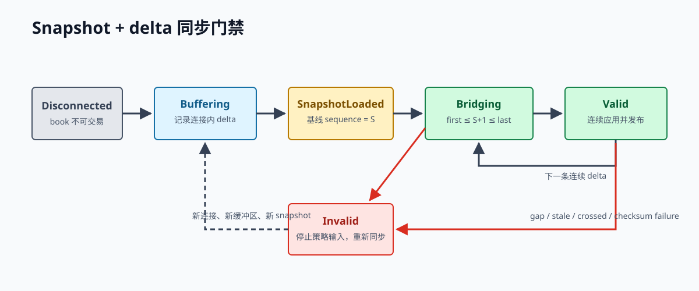

# 第 18 章 行情、时钟与本地订单簿

行情系统的产物不是一个价格，而是一份带来源、序列、时间和可信状态的市场视图。数值看起来合理，不代表它仍然新鲜或来自完整事件链。

> **学习导航**　前置：通过检查点三，并掌握第 9–12 章实时链路｜目标：构建可审计 recorder、同步器、时钟和本地订单簿｜预计：14–20 小时｜产出：公开行情 fixture、百万事件 replay、延迟报告和 gap 演练

## 18.1 Gateway 的边界

建议把公开行情接入拆成：

```text
Transport -> wire decoder -> venue synchronizer -> normalizer
          -> bounded event queue -> local book -> validated snapshot
```

- Transport 管理 TCP/TLS/WebSocket、heartbeat 和重连。
- Decoder 只负责把 wire payload 变成 venue event。
- Synchronizer 实现该 venue 的 snapshot/delta/sequence/checksum 规则。
- Normalizer 转换 instrument、price 和 qty，但保留原始语义和时间。
- Local book 只消费已经通过同步规则的事件。


*-1：raw recorder 与交易路径并行保留事实；任何同步不变量失败都走 invalid 分支。*

不要把重连、解析、同步和策略计算放进一个巨大的 async loop。分层让 fixture、故障注入和状态指标更容易验证。

## 18.2 保存原始事实

normalized 数据便于研究，但不能替代原始 payload。adapter 逻辑升级后，原始数据允许重新解析，也能证明交易所当时发了什么。

每条记录建议包含：

```text
venue, connection_id, channel, instrument
exchange_event_time, local_receive_time, local_record_time
venue_sequence/update_id, payload_length, raw_payload
schema_version, recorder_version, checksum
```

原始文件采用 append-only framing；记录长度与 checksum 可以检测半截尾部。长期存储可以压缩和分冷热层，但不能静默丢掉 schema/version。

## 18.3 四种时间与一个序列

- `exchange_event_time`：交易所定义的事件时间。
- `local_receive_time`：本机收到完整消息或 packet 的时间。
- `local_process_time`：关键处理阶段的时间。
- monotonic duration：本机两个阶段之间的可靠耗时。
- `sequence`：协议或本地因果序列。

研究使用当时本地可见状态，不能按 exchange timestamp 全局重新排序后假装系统当时知道该顺序。跨 venue lead-lag 尤其容易被时钟误差、线路差异和共同数据源伪造。

## 18.4 连接状态不是布尔值

```text
Disconnected -> Connecting -> Subscribing -> Synchronizing
     ^                                            |
     |                                            v
Reconnecting <- Stale/Degraded <- Healthy <-------+
```

只有完成 snapshot/delta 对齐、序列与不变量验证，才能进入 `Healthy`。TCP 活着、ping/pong 正常或订阅 ack 成功，都不表示 book 可以交易。

```rust
#[derive(Debug, Clone, Copy, PartialEq, Eq)]
enum FeedState {
    Disconnected,
    Connecting,
    Subscribing,
    Synchronizing,
    Healthy { last_sequence: u64 },
    Stale,
    Reconnecting,
}

impl FeedState {
    fn can_publish_for_trading(self) -> bool {
        matches!(self, Self::Healthy { .. })
    }
}

fn main() {
    assert!(!FeedState::Synchronizing.can_publish_for_trading());
    assert!(FeedState::Healthy { last_sequence: 7 }.can_publish_for_trading());
}
```

## 18.5 Snapshot + delta 的通用思路



*-2：重连只恢复 transport；找到覆盖 `S+1` 的桥接增量并连续应用后，book 才重新 valid。*

各 venue 细节不同，但调查时可使用以下框架：

1. 建立增量流并缓存事件。
2. 获取 REST 或 WS snapshot，记录它覆盖的序列点。
3. 丢弃 snapshot 之前的增量。
4. 找到协议定义的首个可衔接增量。
5. 应用连续 delta，验证 checksum 与 book 不变量。
6. 原子发布 `Healthy` book。
7. 一旦 gap/checksum failure，立刻 invalid，重新同步。

有些 venue 要先快照再订阅，有些提供 update ID 区间，有些要求 previous sequence；通用步骤不能替代官方算法。

## 18.6 显式 Book 状态机

```rust
#[derive(Debug, Clone, Copy, PartialEq, Eq)]
enum BookState {
    Empty,
    Synchronizing,
    Healthy { last_sequence: u64 },
    Invalid { expected: u64, received: u64 },
}

impl BookState {
    fn on_delta(self, sequence: u64) -> Self {
        match self {
            Self::Healthy { last_sequence } if sequence == last_sequence + 1 => {
                Self::Healthy { last_sequence: sequence }
            }
            Self::Healthy { last_sequence } if sequence <= last_sequence => self,
            Self::Healthy { last_sequence } => Self::Invalid {
                expected: last_sequence + 1,
                received: sequence,
            },
            other => other,
        }
    }

    fn is_tradable(self) -> bool {
        matches!(self, Self::Healthy { .. })
    }
}

fn main() {
    let state = BookState::Healthy { last_sequence: 10 }.on_delta(12);
    assert_eq!(state, BookState::Invalid { expected: 11, received: 12 });
    assert!(!state.is_tradable());
}
```

重复事件是否可忽略取决于协议和更新幂等性。示例只表现“旧序列不回退”，真实实现需用 fixture 证明。

## 18.7 一次更新要原子验证

应用 delta 的安全顺序：

1. 校验 instrument、sequence 和字段范围。
2. 应用到单写者持有的 book。
3. 验证 top-of-book、深度、checksum 等不变量。
4. 更新 last sequence。
5. 发布带版本的只读视图。

如果某项失败，策略必须看见 invalid 状态，而不是继续使用上一次 mid。可以保留旧数据用于诊断，但不能把它标成新鲜行情。

## 18.8 Freshness 不是固定常数

行情年龄应基于本地 receive/process 时间与当前 monotonic time。阈值取决于：

- 产品正常消息间隔和心跳规则。
- 策略预测 horizon。
- 当前波动、spread 和仓位。
- send/cancel RTT 与替代价格源。
- 当前能否可靠撤单与对冲。

因此可以使用分级动作：轻微变旧时 widen/resize，超过硬阈值时禁止增险并撤单。硬风险门槛仍需有明确上限，不能完全交给策略。

## 18.9 重连与重同步不同

重连后要依次完成：

```text
socket connected -> subscribed -> snapshot/delta aligned
-> checksum/invariants valid -> fresh enough -> strategy may trade
```

重连策略使用 exponential backoff + jitter，限制并行连接与订阅速率，避免重连风暴触发封禁。新连接不得沿用旧 book，除非协议明确证明连续。

## 18.10 行情背压

当 decoder 比 engine 快：

- 不能丢任意 L2 delta 后继续发布。
- 可以对独立、可替代的 ticker/feature snapshot 合并到最新版本。
- queue age 超限比 queue length 更直接反映策略看到旧世界。
- 长期过载应 invalid/risk-off，而不是用更大无界队列掩盖。

容量计算需要峰值消息率、处理能力、burst 时长和最大 age。还应使用录制的极端窗口做 2 倍或更高倍率回放。

## 18.11 指标与告警

连接：

- connection state、last byte/message/valid event time。
- reconnect/resubscribe/resync count 与 duration。
- ping/pong 与业务 heartbeat。

数据：

- message/byte rate、decode error。
- sequence gap、duplicate、out-of-order、checksum failure。
- exchange-to-receive、receive-to-process、queue age。
- book validity、crossed/locked count、top/depth。

告警要结合状态。例如 market data age 超限且策略仍 enabled 应立即 page；策略已自动 risk-off 仍要告警，但严重度可按剩余暴露调整。

## 18.12 确定性回放

recorder 输出应能直接输入离线 replay。同一原始事件与 adapter 版本必须生成相同 normalized events、book states 和 checksum。真实 wall clock、随机重连和网络不应渗入纯 book reducer。

回放测试至少注入：

- 删除一个 delta。
- 重复一个 delta。
- 交换两个事件。
- checksum 不一致。
- snapshot 获取慢于增量缓存容量。
- TCP 活着但长时间无有效事件。

## 18.13 Recorder 的存储设计

最简单可审计的 recorder 可以使用分帧 append-only 文件：

```text
file header:
  magic | format_version | venue | connection_id | created_at

record:
  record_length | local_sequence | receive_time | payload_length
  | raw_payload | checksum
```

`record_length` 让 reader 跳到下一条，checksum 检测 bit corruption 和半截尾部。文件滚动按时间或大小进行，manifest 记录每个 shard 的首尾 sequence、首尾时间、字节数、checksum 与 schema/recorder 版本。

写盘路径不能无限阻塞行情任务。常见方案是网络任务把 owned buffer 放进有界 recorder channel，由专门 task 批量写入；channel age/容量超限时必须告警并根据研究/审计要求决定 risk-off。若系统声称原始行情是恢复证据，就不能在压力下静默丢失再继续交易。

敏感私有流与公开行情要分开存储和授权。原始订单/账户 payload 可能含账户标识，不应进入普通研究 bucket。日志只引用受控 object key 和 checksum，不复制完整敏感数据。

## 18.14 重同步的实现细节

同步器最好不直接修改当前 healthy book，而是在隔离的 candidate 上工作：

```text
active_book: Invalid(old version)
candidate_book: load snapshot -> apply buffered deltas -> validate
if success:
  atomically publish candidate as new active version
else:
  discard candidate and retry with backoff
```

每次 sync attempt 带唯一 ID，指标记录 snapshot latency、buffered count、失败 reason 和完成 sequence。这样一次重连风暴中可以区分：网络连接反复失败、snapshot 太慢、buffer overflow、sequence 无法衔接或 checksum 算法错误。

策略引用 `(book_version, sequence, received_at)`。即使内存地址被新 candidate 替换，历史 decision log 仍能追到当时版本。不要只记录 mid；事后需要知道决策基于哪一份完整 book。

如果多 symbol 共用一个 WebSocket，单 symbol gap 是否要求重连整个连接取决于协议。设计时分开 connection health 与 per-channel/book health，避免一个产品异常不必要地停掉全部产品，也避免连接整体 sequence 损坏时只修一个 symbol。

## 18.15 测量跨所延迟的陷阱

假设 A 的 exchange timestamp 比 B 早 3 ms，不能直接得出 A 领先 B。可能的时间线：

```text
A 撮合时钟快 2 ms
A 消息网络耗时 8 ms
B 撮合时钟慢 1 ms
B 消息网络耗时 2 ms
本地先看到 B，事后 exchange timestamp 却把 A 排在前面
```

跨所研究至少保留 local receive time，并记录主机 NTP/PTP offset、网络路径和数据源位置。能测 kernel receive timestamp 时，区分 packet 到达内核与应用读取延迟；否则 event-loop stall 可能被误认为网络慢。

策略可执行的 lead-lag 不是“谁的 exchange time 更早”，而是“某信息在本地可见后，是否在完成计算和订单发送所需时间内，对另一 venue 的未来可成交价格仍有预测性”。这一定义自然包含部署位置和 send latency。

## 18.16 行情异常调试手册

看到 crossed book 或 checksum failure 时，按证据层次调查：

1. 找到 connection ID、channel、instrument 和 sync attempt。
2. 从原始 recorder 重放，不依赖线上内存日志。
3. 验证 decoder 是否保留字段精度和删除语义。
4. 对照官方同步条件检查 snapshot/delta 边界。
5. 检查 duplicate/out-of-order 是网络事实还是 task 重排。
6. 比较官方 checksum 前的排序、字符串格式和档位截断。
7. 确认 metadata/tick 版本在事件窗口内是否变化。
8. 修复后用原始最小反例和完整窗口回归。

不要在未找到原因时简单把 `bid >= ask` 的档位删掉“修正”book。这会隐藏输入或同步错误，并产生从未在 venue 存在过的本地市场。

## 18.17 本章交付

实现一个公开行情 recorder 和 L2 reconstructor，连续运行并产出：

- 原始数据文件、schema 和 checksum。
- 正常与 gap fixture。
- snapshot/delta 同步状态图。
- 100 万事件 deterministic replay 结果。
- p50/p99/p99.9 wire-to-book 与 queue age。
- 一份重连、gap 和 stale 演练记录。

本章完成标准：系统任何时候都能回答“这个 book 是否可交易、最后连续序列是什么、多久以前收到、为什么相信它”。
