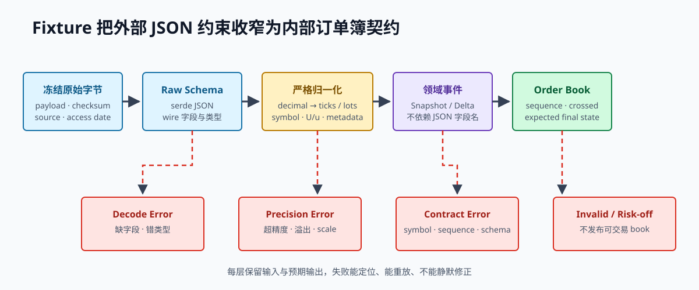

# 第 20 章 用固定样本验证交易所协议

前两章说明了怎样维护可靠行情，以及怎样用适配器隔离交易所差异。本章保存一份按 Binance 现货订单簿公开格式构造的教学样本，让原始消息、数值转换、序号检查和最终订单簿形成一条可运行路径。样本不是真实市场记录，也不能代表交易所当前规则；正式接入时仍需按[附录 E](appendix-e-references.md)复核官方文档。

> **学习导航**
>
> - 开始前：理解单位类型、订单簿同步和交易所适配器。
> - 这一章学会：用保存下来的原始消息反复验证解析与更新规则。
> - 大约需要：8–12 小时。
> - 做完留下：样本说明、严格解析器、快照/增量回放和格式变更报告。

> **开章场景：交易所改了一个字段，程序却没有立即报错**
>
> 昨天交易所返回的数量是数字 `10`，今天变成了字符串 `"10"`。宽松解析器把两种格式都接受了，但另一个新增字段改变了这条消息的含义，问题直到订单簿算错才暴露。若测试每次都请求真实接口，返回内容和网络状态还会不断变化，很难稳定重现这次错误。
>
> 固定测试样本（fixture）是保存下来的原始请求或消息，并配有明确的预期结果。**本章要解决的是：怎样逐字段说明一个交易所协议样本，并用可重复测试及时发现格式和语义变化。**

> **第一次阅读建议**
>
> 把本章看成一次“保存考题和标准答案”的练习：原始 JSON 是考题，最终订单簿和错误类型是标准答案。先读 20.1 至 20.7 并实际运行示例；格式升级和私有接口部分可以第二次再读。

## 20.1 为什么要保存固定测试样本

若自动测试每次都连接真实交易所，会有三个问题：网络和请求限制使结果不稳定，今天的响应无法复现过去的规则，缺字段或序号中断等异常也很难按需出现。保存固定样本后，可以同时记录：

- 原始消息字节和校验值。
- 接口或数据流名称、文档地址、访问日期和样本生成日期。
- 产品的价格与数量精度，以及产品规则版本。
- 预期的内部事件、最终订单簿和错误。
- 样本是实录、官方示例还是合成值。

本书配套文件明确标记为“合成的契约测试样本”（synthetic contract fixture）。它只能证明解析器符合这份已知消息格式，不能证明当前线上连接正常、真实数据完整，更不能证明策略能够盈利。

## 20.2 完整快照的原始消息

下面是保存的完整订单簿快照样本：

~~~json
{{#include ../code/fixtures/binance-spot-btcusdt-snapshot.json}}
~~~

`lastUpdateId` 表示这份完整状态已经覆盖到哪个更新编号。`bids` 和 `asks` 分别保存买卖报价，其中价格与数量是字符串。不能先把它们转成二进制浮点数，再尝试恢复最小价格和数量单位，因为中间可能损失十进制精度。本例明确规定价格和数量各保留两位小数。

## 20.3 增量更新的原始消息

下面三条 `depthUpdate` 消息只描述快照之后发生的变化：

~~~json
{{#include ../code/fixtures/binance-spot-btcusdt-deltas.jsonl}}
~~~

本例使用六个字段：`E` 是事件时间，`s` 是产品代码，`U` 和 `u` 是本次更新覆盖的首尾编号，`b` 和 `a` 是买卖两侧的变化。数量 `0.00` 表示删除这个价位。适配器先保存原始消息，再转换成内部增量事件；订单簿本身不应依赖某家交易所的 JSON 字段名。

## 20.4 小数转换必须服从产品精度

假设产品规则规定价格保留两位小数：

~~~text
"100.01"   -> 10,001 ticks
"100.0100" -> 10,001 ticks  # 超出部分全为零，可规范化
"100.011"  -> reject        # 非零超精度，不能静默舍入
~~~

配套的 `parse_decimal` 函数只接受非负的普通十进制字符串。它使用带溢出检查的整数运算，并拒绝科学计数法、非数字值、负数和过大数值。增量消息用零数量表示删除价位，所以数量可以为零；价格仍必须大于零。

真实适配器是否允许舍入，要看正在处理什么。公开行情是交易所已经发出的事实，通常不应擅自舍入；下单请求则可以根据买卖方向、限价和价格保护规则选择明确舍入方式。二者不能共用一个“差不多就行”的转换函数。

## 20.5 快照与增量怎样接起来

本教学样本的基线为 100，后续事件依次覆盖 101、102、103：

~~~text
snapshot lastUpdateId=100
delta U=101,u=101 -> apply
delta U=102,u=102 -> apply; delete ask 100.02
delta U=103,u=103 -> apply; delete bid 100.00, resize ask 100.03
~~~

最终 book：

~~~text
best bid = 100.01 x 0.50
best ask = 100.03 x 0.75
last sequence = 103
~~~

配套订单簿允许一条增量覆盖下一个期望序号：只要 `U <= 期望序号 <= u`，就应用这条消息，并把已处理序号推进到 `u`。这只是本教学样本的规则；接入真实数据流时，必须严格实现对应接口当前规定的同步步骤、缓存范围和校验规则。

## 20.6 从原始消息到订单簿

下面的示例程序只读取仓库内的固定样本，不访问网络：

~~~rust,ignore
{{#include ../code/examples/venue_fixture.rs}}
~~~

运行：

~~~bash
cargo run --locked --manifest-path book/code/Cargo.toml --example venue_fixture
cargo test --locked --manifest-path book/code/Cargo.toml venue_fixture
~~~

数据依次经过以下步骤，每一步只承担一种责任：

~~~text
读取原始字节 -> 按 JSON 字段解析 -> 严格转换十进制数值
-> 生成内部快照和增量事件 -> 检查订单簿规则 -> 对照预期最终状态
~~~

如果最终检查失败，就能进一步定位是字段格式、数值转换、更新序号还是订单簿更新逻辑出错，而不是在一个庞大的 JSON 回调函数里猜测。

## 20.7 还要保存失败样本

只有正常样本不足以验证行情接入。至少要从它派生出三组失败样本：

- 删除 102：应用 103 时发现序号缺口，期望 102 却收到 103，订单簿变为不可用。
- 重复 101：按照交易所规则忽略已经覆盖的事件，或进入明确的重复分支，不能把它当成新变化再次累计。
- 交换 102/103：不得因为最终价格“看起来合理”就接受乱序。

出现序号缺口后，即使继续收到 104、105，也不能自动恢复可信状态。程序必须重新取得完整快照、接上缓存的增量并完成全部检查。连续收到消息只证明连接仍在传输数据。

## 20.8 消息格式变化时怎样处理

交易所升级接口时，消息格式可能发生三类变化。不能只看“JSON 还能不能解析”，还要判断业务含义是否改变。

| 变化类型 | 示例 | 默认动作 |
| --- | --- | --- |
| 可兼容增加 | 新增一个尚未使用的统计字段 | 保存原始字段，解析器可暂时忽略但要监控 |
| 危险的含义变化 | 数量含义、编号有效范围或零值含义改变 | 停止增加风险，更新规则和测试样本 |
| 无法兼容的结构变化 | 必填字段缺失，或字符串变成对象 | 报告解析错误，不生成内部业务事件 |

Serde 默认允许未知字段，有助于兼容无害增加，但这不是忽略交易所公告的理由。对于影响订单和资金的字段，应维护明确的原始消息结构、指定版本负责人并监控变化。是否拒绝所有未知字段，要根据每类消息的兼容策略决定，不能对全系统机械套用同一选择。

固定样本也不能只保存旧版本的正常情况。每次消息格式升级，至少同时保留旧版和当前版样本，用它们证明兼容范围、拒绝条件和历史回放结果。

## 20.9 产品规则必须与原始消息配套保存

同样的字符串 `100.01`，当最小价格变动是 `0.01` 时表示 10,001 个最小单位；当最小价格变动是 `0.1` 时却是不合法价格。因此，样本清单（fixture manifest）必须把消息与当时的产品规则绑定在一起：

~~~text
交易所 + 数据频道 + 产品代码
消息格式版本 + 产品规则版本
最小价格/数量单位 + 最低下单要求 + 生效时间
原始消息校验值 + 预期内部事件校验值
解析器代码版本 + 测试名称
~~~

历史回测必须使用事件发生时有效的产品规则，生产启动则使用当前经过批准的版本。用今天的规则重新解释过去消息，会在不显眼的地方改写历史数据。

## 20.10 从公开行情到私有协议

公开订单簿样本不需要 API 密钥，适合作为第一个真实消息格式练习。扩展到账户订单和成交等私有协议时，再增加：

- 请求签名前的标准字符串和固定签名结果，密钥只使用测试值。
- 新建、撤销和查询请求，以及网络结果与业务结果。
- 成交先于订单确认、重复成交和按本地订单编号查询。
- HTTP 429 响应、共享请求额度和为撤单预留的容量。
- 敏感字段脱敏测试，确保固定样本不含真实凭据或账户信息。

不要一开始就录制整个真实账户。小而明确的合成私有样本更容易审查，也更适合放入开源作品集。

## 20.11 怎样评审一份固定样本

评审者应能回答：

1. 哪个字段决定事件顺序，是否可能是区间？
2. 零数量表示删除价位、无效数据，还是业务上允许的零？
3. 价格和数量精度来自哪里，从何时开始生效？
4. 原始消息是否完整保留，内部事件能否重新生成？
5. 删除任一事件后为何一定停止发布可交易 book？
6. 新增、缺失和改变类型的字段分别发生什么？
7. 样本是真实记录、官方示例还是合成数据，能证明什么、不能证明什么？

这些答案应写入样本清单、测试和适配器版本记录，不能只存在作者记忆里。

## 20.12 本章练习

1. 删除 102 号增量，检查订单簿变为不可用，风控也拒绝新增订单。
2. 为小数解析器增加溢出、负数、空字符串、科学计数法和精度超限测试。
3. 给原始增量增加未知字段，再删除必需字段 `U`，比较可兼容增加与破坏性变化。
4. 选择另一家交易所的公开接口，建立同等规模的合成契约样本和功能差异表。
5. 生成样本清单，记录来源、文档访问日期、数值精度、校验值和预期最终订单簿。

本章完成标准：一条公开原始消息可以稳定重放成内部订单簿；规则来源、数值精度、更新序号、失败路径和证明边界，都能由另一位工程师复核。

## 20.13 回顾与下一章

固定样本把对某个协议版本的理解变成可重复检查：原始字节和校验值保护样本内容，清单记录来源和产品规则，解析器测试字段与精度，同步器测试更新序号，最终订单簿验证整条处理路径。新增未知字段可能兼容，不代表删除必需字段或改变字段类型也能兼容。

固定样本的证明范围必须诚实。合成样本能稳定覆盖难以制造的序号缺口和非法小数，真实录制样本能暴露线上字段组合，官方示例能帮助对照文档；三者都不能单独证明当前线上连接正常，也不能覆盖所有账户规则。

下一章把相同方法用于更危险的私有事件。订单确认、成交、撤单和查询结果可能重复、乱序，甚至跨越进程重启到达。订单管理系统必须根据这些不完整事实逐步还原状态，不能假设消息总按理想顺序返回。
