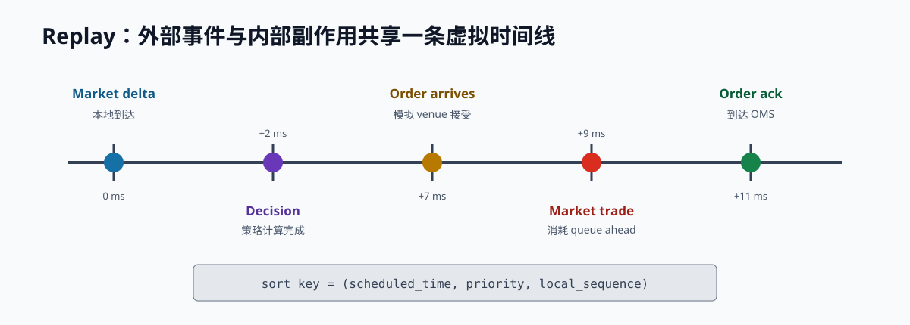

# 第 21 章 数据、回测与仿真

回测不是把历史价格喂给策略。交易系统在当时只能看到延迟、不完整且有协议顺序的数据；订单还要经历发送、接受、排队、部分成交、撤单和成交回报。忽略这些步骤，漂亮收益通常只是成交模型的产物。

> **学习导航**　前置：通过检查点四，拥有可复用 book/OMS/risk/accounting｜目标：构建 point-in-time、事件驱动且可确定复现的交易仿真｜预计：18–24 小时｜产出：回放调度器、三层 fill model、成本敏感性和对账报告

## 21.1 研究假设先行

开始写代码前定义：

- 经济机制：谁支付收益，为什么会持续？
- signal、label 与预测 horizon。
- 决策时点可见的数据。
- 订单类型、venue 与执行路径。
- fee、funding、borrow、slippage 与 impact。
- 失效条件与容量边界。
- 训练、验证、测试和最终 holdout。

先写假设能减少“看完结果再发明故事”的自由度。

## 21.2 数据层次与 lineage

至少保留三层：

```text
raw payload -> normalized event -> derived feature/label
```

每个数据产物带：原始文件 checksum、schema version、adapter/transform 版本、配置、时间范围和输出 manifest。衍生表应能追到原始记录。数据缺口是一等事件，不可静默 forward-fill order book 穿过断线。

需要的数据通常包括：

- L2 snapshot/delta、trade、mark/index/funding。
- instrument metadata 和规则变更。
- 自己的 intent、request、ack、fill、cancel、position 与 balance。
- fee tier、borrow、transfer 和结算记录。
- 本地 receive/process 时间、连接状态和延迟。

## 21.3 Point-in-time 语义

策略在时刻 `t` 只能使用 `t` 之前已经到达本地的数据。常见前视错误：

- 按 exchange timestamp 全局重排跨所事件。
- 用当天结束后发布的 metadata 修正当天订单。
- 用最终完整 candle 在 candle 内决策。
- 用未来 snapshot 填补断线窗口。
- 用成交结果决定当时的 queue position。

replay clock 应由输入事件推进，禁止核心策略直接读取真实系统时间。

```rust
trait Clock {
    fn now_ns(&self) -> u64;
}

struct ReplayClock {
    now: u64,
}

impl Clock for ReplayClock {
    fn now_ns(&self) -> u64 {
        self.now
    }
}

fn is_fresh(clock: &impl Clock, received_at: u64, max_age: u64) -> bool {
    let now = clock.now_ns();
    received_at <= now && now - received_at <= max_age
}

fn main() {
    let clock = ReplayClock { now: 1_500 };
    assert!(is_fresh(&clock, 1_450, 100));
    assert!(!is_fresh(&clock, 1_000, 100));
    assert!(!is_fresh(&clock, 1_600, 100));
}
```

回放调度键必须来自输入事件本身，而不是 reader 当前的插入顺序。对同一时间和优先级，使用来源日志中的 `local_sequence`；这样把输入文件打乱后，事件顺序仍保持不变。`local_sequence` 在同一时间/优先级范围内必须唯一，重复键应直接作为录制或合并错误处理。

```rust,ignore
let mut replay = Replay::default();
replay.schedule(event.at_ns, event.priority, event.local_sequence, event)?;
```

## 21.4 Live 与 Replay 共用领域逻辑

理想结构：

```text
Live source ----\
                 -> Domain events -> reducers -> strategy/risk -> intents
Replay source --/                                      |
                                                        v
                               Live gateway or simulated exchange
```

网络层无需完全共用，但 normalized event、book/OMS reducer、risk 和 accounting 应尽量相同。研究与生产各写一套报价逻辑会快速产生语义漂移。

相同输入、配置和 seed 必须得到相同 intents、simulated fills、position 和 PnL。随机模型的 seed 与抽样算法版本也是实验输入。

## 21.5 模拟交易所，而不是直接改仓位

策略调用 `cancel()` 时，模拟订单不能立刻消失。订单应经历：

```text
intent -> send latency -> accept/reject -> queue
-> partial/final fill or cancel request
-> cancel latency -> final venue event -> report latency
```

模拟事件仍通过同一个 OMS reducer 和账本。这样 cancel/fill race、duplicate 和 uncertain 场景可以在线下重放。

## 21.6 成交模型层级

| 模型 | 规则 | 主要偏差 |
| --- | --- | --- |
| Touch fill | 市场触及挂单即成交 | 极度乐观 |
| Trade-through | 价格穿过才成交 | 忽略同价队列 |
| L2 queue | 估计 queue ahead 和 depletion | cancel/trade 不可识别 |
| L3 replay | 逐订单排队 | 仍缺本地/网关延迟与隐藏流动性 |
| 撮合仿真 | 完整可控事件环境 | 与真实参与者行为有差距 |

至少使用乐观、中性、悲观参数包。若策略只有 touch fill 盈利，结论通常不足以进入 canary。

## 21.7 L2 Queue 模型

挂单到达时估计 `queue_ahead`，同价可见深度减少时决定多少归因于前方成交/撤单。三种边界：

- 乐观：撤单优先发生在自己前方。
- 悲观：撤单优先发生在自己后方，只有明确 trade 才消耗前方。
- 概率：按历史事件、位置或参数分配 depletion。

结果需要对 queue 假设做敏感性。小额 canary 的真实 fill/markout 可以校准模型，但不要用同一时期校准又报告最终效果。

## 21.8 延迟模型

至少拆分：

- market-data transport/processing。
- strategy decision 与 queue residence。
- order send/venue acceptance。
- cancel send/effective。
- fill report/risk state update。

延迟可以来自实测经验分布，不应只填一个平均常数。做 1x、2x、5x、10x 情景，观察 stale fill、markout、库存尾部和优势消失点。

## 21.9 成本随事件变化

每笔事件计算：

- maker/taker fee 与 tier。
- funding 实现现金流。
- spread/depth walk 与 slippage。
- borrow/interest。
- 资金转移和网络成本。
- 必要时的 market impact 和机会成本。

不要最后统一扣一个平均百分比。策略改变订单类型、频率和持仓路径时，成本也会改变。

## 21.10 市场冲击与容量

小额 maker 可以先忽略对 mid 的直接影响，但不能忽略自己的 queue footprint。主动或规模较大的策略需要 depth walk、participation rate、temporary/permanent impact 情景。

容量不是“把订单乘十再乘 PnL”。规模增长会改变：

- 可成交价格和排队时间。
- maker/taker 比例。
- 对冲成本与完成时间。
- margin、fee tier 和 venue concentration。
- 策略对市场状态的反馈。

## 21.11 PnL 账本先于归因

模拟 fill ledger、position ledger 和 cash ledger 应日内/日终对账。先验证：

```text
equity change = external cash flow
              + realized PnL + unrealized change
              + funding income - fees - other costs
```

再报告 spread capture、signed markout、inventory revaluation、hedge slippage 和 attribution residual。回测“盈利”但账本不闭合，是实现错误而不是小统计问题。

## 21.12 防止过拟合

- 按时间顺序 train/validation/test，保留最终 holdout。
- walk-forward 只用过去数据重新估计。
- 参数搜索要记录全部尝试，不只保存赢家。
- 多重检验降低偶然最好结果的可信度。
- 报告参数邻域，而不是单个最优点。
- 按 volatility、spread、depth、趋势和事件 regime 拆分。
- block bootstrap 或适合相关序列的方法估计不确定性。

Sharpe 不是完整答案。还要看样本长度、非平稳、偏度/尾部、turnover、drawdown、容量与成本误差。

## 21.13 从离线到生产

1. **Offline replay**：验证逻辑、偏差和故障事件。
2. **Shadow**：消费生产行情、生成意图但不发单，检查实时性和稳定性。
3. **Testnet**：验证认证、订单状态机、重连和操作流程；不外推成交率或收益。
4. **Production canary**：单 symbol、最小 size、硬限额，比较模拟与真实 fill/latency/fee。
5. **逐步扩大**：每一级有进入/退出 gate、owner 和 kill switch。

仿真与 canary 差异反馈给模型，不能修改实盘报表来隐藏。

## 21.14 研究报告最低结构

- Executive summary：结论、证据强度、是否继续。
- Hypothesis and mechanism。
- Data and point-in-time semantics。
- Method、成交/延迟/成本模型。
- Out-of-sample result 与不确定性。
- PnL attribution、capacity 和 stress。
- Risks、failure conditions 与不可识别部分。
- Shadow/canary 校准计划。

## 21.15 事件调度器的确定性

replay 不应简单遍历行情文件，因为策略产生的内部事件也有时间：订单到达 venue、cancel 生效、funding 结算、timer 和 fill report 都要与市场事件竞争。

使用按 `(scheduled_time, priority, local_sequence)` 排序的最小堆：

```text
10:00:00.000 market delta arrives locally
10:00:00.002 strategy decision completes
10:00:00.007 new order reaches simulated venue
10:00:00.009 market trade consumes queue
10:00:00.011 order ack reaches OMS
```



*图 21-1：ack 可以晚于影响 queue 的市场事件；模拟器不能按代码调用顺序直接修改订单或仓位。*

回测过拟合、Sharpe 统计和时间序列研究资料见[附录 E](appendix-e-references.md)；引用模型不等于已经满足 point-in-time 与成交校准要求。

如果 order 在 7 ms 到达、trade 在 9 ms 发生，它可能参与成交；若 send latency 变为 12 ms，则不可能用 9 ms 的 trade fill。只在每条行情后“立即运行策略并假设订单生效”会制造前视成交。

同一 timestamp 的 tie-breaker 必须明确。例如 venue market event 先于本地 timer，还是按录制 local sequence；任何选择都可能影响边界 fill，应在报告中说明并做敏感性。

## 21.16 Queue 模型如何校准

从小额 canary 收集：下单确认时可见同价 depth、quote age、期间 trade volume、depth depletion、真实 fill time/qty 和后续 markout。然后比较模拟与真实的条件分布：

- 给定 initial queue estimate，fill probability 是否一致？
- time-to-first-fill 和 completion time 是否偏快？
- partial fill size 分布是否合理？
- cancel 前最后一刻的 fill 是否被低估？
- 哪些 spread/depth/volatility regime 偏差最大？

不要只调一个参数让总 fill count 一致。模型可能在平静期过度成交、极端期不足成交，恰好在总数上抵消。校准和最终验证使用不同时间段，并保留旧模型结果，防止每次实盘偏差都通过追数据参数“解释掉”。

## 21.17 统计显著不等于可交易

一个 signal 在百万条事件上得到很小 p-value，经济效果可能只有 0.2 bps，而费用与模型误差是 5 bps。反过来，少量极端窗口贡献大部分 PnL，普通标准误也可能低估尾部不确定性。

报告需要同时给：

- effect size 和置信区间。
- 样本数、独立事件近似和时间跨度。
- turnover、trigger rate 与可执行容量。
- 参数/特征尝试次数。
- 不同日期、regime 和 venue 的稳定性。
- 成本/latency/queue 误差下的盈亏边界。

微观结构事件高度自相关，随机打散 train/test 会泄漏相邻市场状态。使用按时间块切分、walk-forward、必要的 purge/embargo，并把最后一段 holdout 留到研究决策基本冻结后。

## 21.18 模拟与实盘偏差表

每次 shadow/canary 后维护差异，而不是只比较总 PnL：

| 维度 | 模拟 | 实际 | 可能原因 | 下一验证 |
| --- | --- | --- | --- | --- |
| send-to-ack p99 | 18 ms | 41 ms | 网络/网关抖动 | 分区域测量 |
| maker fill rate | 12% | 6% | queue 过于乐观 | 按 depth 校准 |
| negative markout | -2 bps | -7 bps | stale cancel | 注入真实 cancel latency |
| taker fee | 4 bps | 5 bps | fee tier 过期 | metadata/账单 fixture |
| position tail | 0.4 | 0.9 | fill 相关性 | regime-dependent fill |

模型版本变更要解释哪个偏差被修正，以及在未见 holdout 上是否改善。模拟永远不会变成实盘本身；目标是让重要偏差可测、有边界并进入风险限制。

## 21.19 必做实验

1. 同一策略分别运行 touch、trade-through 和三组 L2 queue 模型。
2. 将 send/cancel latency 扩大 2、5、10 倍。
3. 改变 maker/taker fee 与对冲频率，判断收益是否依赖 rebate。
4. 在断线窗口禁止交易，与错误 forward-fill 结果比较。
5. 用 holdout canary 数据校准后，在下一段未见数据验证。

本章完成标准：任何收益曲线都附带 point-in-time 说明、成交/延迟/成本假设、账本对账、敏感性、容量和不能外推到实盘的部分。
