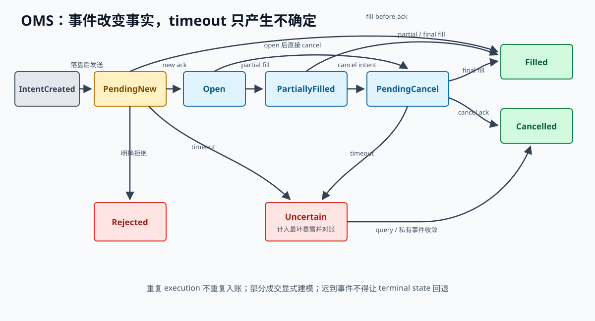

# 第 21 章 订单状态机、接入与对账

交易所接入最难的不是生成签名，而是在消息丢失、延迟或乱序时，仍然正确记录订单、成交和仓位。请求可能已经执行，但响应丢了；成交可能早于订单接受确认到达；撤单确认也可能与最后一笔成交交错。程序重启后，本地与交易所往往都只能提供部分事实。

> **学习导航**
>
> - 开始前：理解超时的未知状态、适配器语义和固定协议样本。
> - 这一章学会：在确认、成交、撤单消息乱序时仍正确维护订单。
> - 大约需要：16–22 小时。
> - 做完留下：状态转换表、十类故障测试、事件日志和对账报告。

> **开章场景：下单超时，成交消息却先到了**
>
> 程序发出一张买单，两秒内没有收到接受确认，于是把请求标记为超时。就在准备重试时，交易所发来一条成交消息；又过一秒，最初的接受确认才到达。若系统把“超时”当成“下单失败”，第二次发送就可能产生额外仓位；若只允许确认后成交，又会丢掉已经发生的交易事实。
>
> 订单管理系统（OMS）不猜远端发生了什么，而是根据请求、确认、成交、撤单、查询和对账证据推进订单状态。**本章要解决的是：怎样在消息重复、乱序、超时和重启时，仍然得到可解释、可恢复的订单记录。**

> **第一次阅读建议**
>
> 先读 21.2 至 21.6，重点理解“意图不等于订单”“超时不等于失败”“先记录再发送”。接着读 21.12，理解状态计算与网络操作为什么分开。崩溃点矩阵和完整对账算法适合第二次结合代码阅读。

> **章节边界：** 适配器负责忠实报告交易所消息，订单管理系统负责把乱序、重复和不完整消息整理成可审计状态。本章不再展开消息格式与签名细节。

## 21.1 订单系统从适配器接收什么

上一章的适配器位于内部订单系统与交易所网络之间：

```text
内部命令和事件
  <-> 交易所适配器
        产品代码映射
        价格和数量转换
        功能与订单规则
        HTTP/WebSocket 消息格式和签名
        错误与请求额度转换
  <-> 网络连接
```

内部业务层可以统一买卖方向、价格、数量、订单意图、成交、仓位和风控决定，但适配器不能隐藏：

- “只挂单”“只减仓”、订单有效时间和持仓模式的具体含义。
- 修改订单是原地完成，还是“先撤旧单、再下新单”。
- 批量请求中每一项各自成功还是失败。
- 请求接收确认、订单接受确认和真实撮合结果之间的区别。
- 本地订单编号与成交编号在哪个范围内唯一。
- 请求额度按哪些维度限制，以及为紧急撤单预留多少。

每个适配器都应发布功能清单，系统启动时先检查它能否满足策略要求。

## 21.2 交易想法不等于交易所订单

策略最先产生的是订单意图（intent），意思是“我希望在某个条件下这样交易”。它还要经过风控、持久化和适配器检查，才会成为发往交易所的请求：

```text
策略决定 -> 风控决定 -> 已可靠保存的订单意图
-> 尝试发送 -> 交易所订单 -> 一笔或多笔成交
```

为了事后把各步对应起来，每一步都带有可追溯编号：

```text
策略决定编号
  -> 风控决定编号
  -> 本地订单编号
  -> 交易所订单编号
  -> 成交唯一键
```

订单编号的取值数量会非常多，适合放在日志和单次请求追踪中；不要直接把它作为监控指标标签，否则指标系统会产生海量不同组合。

## 21.3 订单状态机

先看一条可能发生的时间线：

```text
10:00:00.000  本地记录订单意图
10:00:00.004  请求写入网络
10:00:00.010  交易所接受订单
10:00:00.012  订单成交
10:00:00.020  本地先收到成交消息
10:00:00.023  本地后收到接受确认
```

最后两条消息的到达顺序与交易所实际发生顺序不同，但订单最终都应是“已成交”。状态机把“当前状态”和“新到事件”分开定义，避免代码依赖理想消息顺序：



*图 21-1：超时不证明订单失败；订单会进入“状态未知”，限制新增风险，直到查询或私有消息补足证据。*

图中省略了部分“不改变主要状态”的路径。例如等待撤单确认期间收到部分成交，只增加累计成交量，订单仍处于等待撤单；只有剩余数量也全部成交后才进入“完全成交”。

```rust,ignore
{{#include ../code/src/oms.rs:order_model}}
```

状态归并函数（reducer）只根据“旧状态 + 新事件”计算“新状态 + 待执行动作”，不直接访问网络或数据库：

```rust,ignore
{{#include ../code/src/oms.rs:order_reducer}}
```

下面的可运行示例展示成交消息先于接受确认到达：

```rust,ignore
{{#include ../code/examples/oms_out_of_order.rs}}
```

配套实现使用内存集合查找重复成交，生产版本还需要重启后仍然存在的持久化索引。更重要的是，不能默认一个裸 `trade_id` 在全球唯一。典型的成交键会组合交易所、账户、产品和成交编号，最终范围必须由交易所文档和固定样本证明。

## 21.4 必须保持的不变量

- 累计成交量只能增加，不能超过订单总量。
- 同一个成交唯一键只能改变一次仓位和现金。
- 订单已经完全成交后，迟到的确认或超时事件不能让状态倒退；已撤单后仍要接收迟到成交，若累计数量达到总量，则以成交事实为准。
- 已经请求撤单不等于撤单完成，在等待期间仍可能成交。
- 成交先于接受确认到达时，系统仍能正确处理。
- 非法状态变化、未知订单和超量成交不能被悄悄丢弃，必须进入审计与对账。
- 同一串输入事件每次都应得到相同结果。

状态机应配有完整转换表、成组案例测试、自动生成输入的规则测试，以及事件回放测试。

## 21.5 超时只说明本地停止等待

三条必须分开的事实：

1. 本地有没有尝试发送。
2. 交易所有没有接受订单。
3. 本地有没有收到和持久化确认。

发送或等待响应超时后：

1. 标记为 `Uncertain`（状态未知），保留本地订单编号和请求证据。
2. 不用新编号重发同一增险意图。
3. 按本地订单编号查询，并核对活动订单、近期订单和近期成交。
4. 把这张可能存在的订单计入最坏风险。
5. 长时间无法确认时停止增加风险，并通知负责人员。

“请求失败”只有在得到明确、可信的拒绝时才能成为订单不存在的证据。

为了保持示例简短，配套状态归并函数只使用一个 `Uncertain` 变体，没有记录超时前是在等待新单确认，还是等待撤单确认。生产实现应额外保存正在进行的动作和前一阶段；因为部分成交虽然能证明订单存在，却不能说明撤单请求是否仍在途中。

## 21.6 先落盘，后发送

对可能增加仓位的操作，应采用“预先记录”（write-ahead）顺序：

```text
可靠保存（订单意图、本地订单编号）-> 确认已经越过持久化边界
  -> 发送给交易所
  -> 继续保存（已尝试发送/已接受/已拒绝/状态未知）
```

如果先发送、后记录，进程可能恰好在两步之间崩溃，形成“交易所有订单，本地却没有任何编号”的最坏情况。先记录后发送也会遇到“意图已保存，但请求还没发出”的情况，不过重启后可以先按稳定编号查询，再决定安全重发或作废。

写入操作系统缓存不等于数据已经安全到达磁盘。每张订单都强制刷盘最稳妥，但可能太慢；把多条记录成组刷盘则要明确“崩溃时最多允许丢失多少数据”，这个目标常称为恢复点目标（RPO）。存储可以从只在末尾追加的分段日志起步，但必须测试半条尾记录、内容校验、格式版本、快照替换和强制终止后的恢复。

## 21.7 修改订单可能其实是撤旧下新

需要明确：

- 交易所是否提供一次完成的原地修改。
- 修改是否改变交易所或本地订单编号，以及排队位置。
- 部分成交后的 quantity 表示总量还是剩余量。
- 撤单尚未确认时，是否允许发送替代订单。
- 原订单和替代订单同时活动时，最坏会增加多少仓位。

如果实际流程是“撤销旧单 + 创建新单”，就不要在内部业务层把它伪装成一次原子修改。风控必须能够看见两张订单可能短暂同时存在的中间阶段。

## 21.8 实时私有消息与查询结果共同还原事实

私有 WebSocket 消息通常到达较快，HTTP 查询适合程序启动、定期检查和异常对账。不能机械规定其中一路永远正确，要根据以下证据合并：

- 事件编号、更新序号及其唯一范围。
- 累计成交的单调性。
- 活动状态与终止状态能否被后来事件修正。
- 查询快照覆盖的时间范围及是否还有下一页。
- 私有流断线窗口和查询覆盖范围。

交易所有但本地没有的订单、本地认为存在但交易所查不到的订单，以及仓位差异，都要有明确处理规则。不能只为了让监控面板恢复正常，就在没有审计记录的情况下直接覆盖本地状态。

## 21.9 重启后不能立即恢复交易

恢复关卡（recovery gate）是一组必须全部通过的检查。推荐启动顺序如下：

1. 加载配置、事件日志、状态快照和审计版本。
2. 启动网络、时钟、原始记录和指标。
3. 获取产品规则、账户、余额、仓位、活动订单和近期成交。
4. 恢复私有消息流，并按协议衔接快照与后续变化。
5. 重建订单和仓位，解决或隔离未知状态。
6. 同步公开订单簿。
7. 计算初始风险限额和保证金缓冲。
8. 先只观察或保持停止增险；全部检查通过后，再显式启用交易。

“程序可以响应请求”与“系统可以交易”必须是两个状态。服务通过普通健康检查，不代表它已经可以增加资金风险。

## 21.10 为撤单保留请求额度

每家交易所至少要记录：

- 请求权重、订单数量，以及网络地址、密钥和子账户等限制维度。
- WebSocket 连接数、订阅数、消息速度和下单速度。
- 服务端响应提供的剩余额度与重置时间。
- 普通查询和紧急撤单是否共用同一额度。

本地令牌桶只是对剩余额度的估计。系统要为风险动作预留容量；接近限制时，应减少频繁改价和非必要查询。收到 HTTP 429 后要遵守服务端提示，并使用带随机变化的退避重试，不能用更多重试扩大故障。

## 21.11 对账类型

- 启动对账：重启后重建可信世界。
- 定期对账：发现没有主动报错却逐渐累积的差异。
- 事件触发对账：超时、未知订单、私有流重连或非法状态变化后立即检查。
- 结算对账：核对订单、成交、持仓、余额、交易费用、资金费用和总权益。

每项差异都应记录本地值、交易所值、证据时间、采取的动作，以及是否需要人工确认。

## 21.12 为什么把状态计算与外部操作分开

如果状态归并函数内部直接发送网络请求、写数据库和更新指标，同一事件就无法安全重放：再次处理 `CancelRequested`（请求撤单）会真的再发一次撤单，测试也必须连接复杂的外部环境。

更清晰的模型是先纯粹计算状态，再把需要执行的外部动作交给执行器：

```text
（旧状态，内部事件）
  -> 状态归并函数
  -> （新状态，待执行动作）

待执行动作示例：
  保存记录
  发送新订单
  按本地订单编号查询
  发布风险状态
  发出告警
```

动作执行器（action executor）完成写盘、网络和告警等外部操作，再把结果转换成新的内部事件，例如“保存完成”“发送超时”“交易所已确认”。这样，状态归并函数决定业务顺序，执行器负责输入输出、超时和重试。

关键是不能在动作真正完成前，假装业务状态已经完成。“请求撤单”可以产生“发送撤单”的动作，但此时订单仍可能成交；只有收到可信撤单确认或对账证据后，才能进入“已撤销”。

## 21.13 同一笔成交只能入账一次

“幂等”在这里的含义很简单：同一条成交消息处理一次和处理多次，最终资金结果必须相同。

一笔成交通常同时影响：

- 订单累计成交量和平均成交价。
- 产品仓位和持仓成本。
- 现金或结算资产余额。
- 交易费用和扣费币种。
- 对冲触发、风险暴露和盈亏归因。

这些更新必须围绕同一个成交唯一键一起防重。若订单模块忽略了重复消息，仓位账本却再次入账，重复私有消息仍会制造仓位差异。

可使用事务或单写者事件日志保证原子业务语义：

```text
如果成交唯一键已经处理过：
  检查本次内容与上次一致；不再改变资金状态
else:
  追加一条“成交已接受”记录
  更新订单视图
  更新仓位、现金和费用视图
  发布新的风险状态
```

若同一唯一键对应的价格、数量或费用不同，就不是普通重复。它可能来自适配器错误、交易所修正消息或数据损坏，必须审计和对账，不能简单保留最后一条来覆盖资金事实。

## 21.14 程序可能在哪一步崩溃

对一张新订单，从产生意图到收到确认，逐步列出程序可能崩溃的位置：

| 崩溃位置 | 本地已可靠保存的事实 | 交易所可能的事实 | 恢复动作 |
| --- | --- | --- | --- |
| 意图保存前 | 无 | 尚未发送 | 无外部风险，可以重新生成意图 |
| 意图保存后、发送前 | 已创建意图 | 通常没有订单 | 先按本地编号查询，再决定重发或作废 |
| 发送后、发送记录落盘前 | 已创建意图 | 未知 | 按本地编号查询，并计入最坏风险 |
| 收到确认后、确认记录落盘前 | 已创建意图或发送记录 | 可能活动或已成交 | 查询活动订单和近期成交 |
| 成交记录写入一半时 | 可能有半条记录 | 已成交 | 丢弃校验失败的尾部，再对账成交 |
| 计算后的状态视图更新中 | 事件日志已有成交 | 已成交 | 重放日志，重新生成状态视图 |

这张表决定哪些内容必须预先记录，以及写到哪一步才算可靠保存。只说“我们使用数据库事务”还不够，因为网络发送不在本地数据库事务之内；必须明确哪一步仍可能产生未知订单。

## 21.15 对账不是直接覆盖本地数字

一个可审计的对账流程如下：

1. 固定查询范围和时间，获取活动订单、近期订单、近期成交、仓位和余额。
2. 记录原始响应、翻页位置和查询完成时间。
3. 按本地订单编号、交易所订单编号和成交唯一键，关联本地计算状态。
4. 分类差异，而不是只输出“不一致”。

常见分类：

```text
交易所独有订单       交易所有活动单，本地不知道
本地独有活动订单     本地认为订单活动，交易所查询不到
缺失成交             交易所有成交，本地未入账
成交内容冲突         同一唯一键对应的字段不同
仓位差异             补齐成交后仍然对不上仓位
余额差异             仍有费用、资金费、转账或现金变化无法解释
```

5. 对已经确定、重复执行也安全的事实补充事件，例如导入缺失成交。
6. 对含义仍不确定的差异保持停止增险，扩大查询范围或交给人工判断。
7. 重放事件并重建本地状态，再核对仓位、余额和总权益。
8. 输出对账报告，记录每项修正的证据来源。

HTTP 查询结果本身可能分多页、存在延迟，或稍后才达到一致。查询过程中还可能发生新成交，所以需要用私有流序号、进度边界，或交易所规定的方法，把查询快照与后续事件接起来。

## 21.16 本章故障序列

下面每一项都代表真实系统可能遇到的消息顺序，必须用测试覆盖：

1. 等待新单确认时，成交先到，接受确认后到。
2. 活动订单请求撤销后，先部分成交，再收到撤单确认。
3. 活动订单请求撤销后，先完全成交，再收到迟到的撤单确认。
4. 同一成交事件重复到达。
5. HTTP 请求确认与 WebSocket 成交消息乱序。
6. 发送超时，随后查询发现订单仍在活动。
7. 发送超时，随后收到一笔此前未知的成交。
8. 私有流断线期间发生成交，重连后通过近期成交查询恢复。
9. 进程在订单意图保存后、请求发送前崩溃。
10. 进程在请求发送后、接受确认保存前崩溃。

本章完成标准：任意时刻能回答“交易所可能认为有哪些订单、本地为什么相信当前状态、未知状态如何限制风险并最终对账”。

## 21.17 回顾与下一章

订单管理系统维护的是“随着证据增加而逐步明确”的订单状态，不是一次请求立即得到一次结果的普通增删改查。订单意图先可靠保存，再尝试发送；纯状态归并函数接收 HTTP、私有流和查询事实并产生待执行动作，执行器完成网络和存储操作后，再把结果作为新事件送回。这样重放历史时不会真的重复发送网络请求。

成交先于接受确认、撤单与成交交错、终止消息迟到，都是必须处理的合法时序。超时只表示本地停止等待，订单必须进入未知状态，计入最坏风险，并按稳定的本地编号查询和对账。成交使用范围明确的唯一键防止重复入账；订单结束后，也不能立即删除仍用于查重和审计的历史事实。

下一章会把活动、等待确认和状态未知的订单，一起交给独立硬风控。策略只能提出报价与对冲意图，风险组件则根据新鲜行情、可信仓位和在途订单，决定是否允许增加风险。
