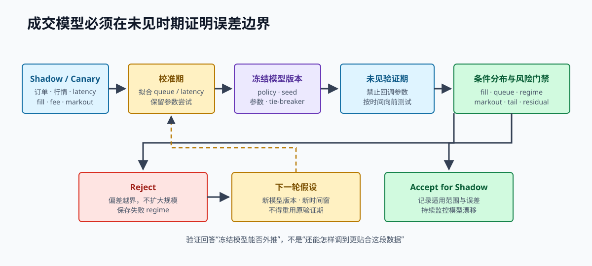

# 第 24 章 模拟交易所与成交模型校准

回测框架能按时间调用策略，不代表成交可信。模拟交易所必须回答订单何时到达、是否有资格参与队列、撤单何时生效、成交报告何时可见，以及这些假设与真实观察相差多少。

> **学习导航**
>
> - 开始前：理解订单排队、消息时间、订单管理和事件回放。
> - 这一章学会：模拟订单何时可能成交，并用新数据检查模拟偏差。
> - 大约需要：14–20 小时。
> - 做完留下：三类成交模型、延迟参数、校准报告和拒绝条件。

> **开章场景：市场成交了 20 个，你的 1 个就算成交吗**
>
> 你在 100 元挂出买入 1 个的限价单，历史数据随后显示 100 元成交了 20 个。简单模拟器立即判定你的订单全部成交，但当时同一价格前面可能已经排着 500 个买单，那 20 个成交根本轮不到你。若模拟器每次都这样优待自己，策略收益会被系统性高估。
>
> 成交模型要明确订单何时到达、前方可能有多少数量、哪些成交会消耗队列，以及确认与成交消息何时返回。**本章要解决的是：怎样给模拟成交划定乐观和保守边界，再用未参与调参的数据检查模型是否接近现实。**

> **第一次阅读建议**
>
> 先读 24.1 至 24.7，理解订单到达时间、排队和撤单生效时间。再读 24.9 至 24.11，掌握“用一段数据调参数、用另一段数据验证”的基本方法。联合延迟分布和详细敏感性矩阵可以第二次再读。

配套模拟器的完整实现位于 `book/code/src/simulator.rs`。教学版本会在订单结束后继续保留必要记录，用于对账并阻止本地订单编号被悄悄重复使用。处理百万事件时，可以把活动订单、只保留一段时间的终止记录和永久使用过的编号集合分开存储；不能在成交或撤单后立即删除全部事实。

## 24.1 模拟器的权限边界

模拟器可以维护“虚拟交易所认为发生了什么”，但不能直接修改策略仓位：

~~~text
策略订单意图 -> 独立硬风控 -> 模拟请求
-> 交易所接受、拒绝、成交或撤单消息
-> 订单状态更新 -> 成交账本 -> 仓位与账户权益
~~~

若模拟器一看到价格命中就直接执行“仓位加数量”，就绕过了成交编号、消息乱序、重复消息、交易费用和订单状态机。这种回测没有经过真实运行所使用的路径，因此无法验证生产逻辑。

## 24.2 一张订单至少有四个时间

一笔订单至少有：

~~~text
t_decide   策略创建订单意图
t_send     接入层把请求写入网络
t_accept   交易所接受订单，订单从此有资格成交
t_report   接受确认到达本地订单管理系统
~~~

成交还有“真正撮合的时间”和“成交消息到达本地的时间”。因此完全可能出现：

~~~text
t_accept < t_match < t_fill_report < t_report(new_ack)
~~~

这就是“成交消息先于接受确认到达”，并不一定是异常数据。模拟器若强制先返回确认、再允许成交，就会掩盖真实系统必须处理的消息顺序。

## 24.3 三种基础成交模型

**触价即成交（Touch）**：对手方最优价格碰到限价，就认为订单全部成交。它适合作为乐观上界，也可以简化已经能够立即成交的限价单；不适合直接代表普通挂单的真实成交情况。

**穿价才成交（Trade-through）**：只有市场成交价严格穿过自己的限价，才认为全部成交。它忽略同价成交，通常更保守，但仍没有部分排队信息。

**二档排队模型（L2 queue）**：订单到达时估计前方排队数量。正确方向的同价市场成交先消耗前方数量，剩余成交量才分给自己的订单；市场价格穿过限价时，则认为订单剩余部分成交。

配套实现固定了这些规则。下面的可运行示例证明成交报告可以早于新单接受确认到达：

~~~rust,ignore
{{#include ../code/examples/simulator_fill_before_ack.rs}}
~~~

## 24.4 订单到达之前不能参加成交

订单在交易所接受之前还没有排队位置。考虑下面的时间线：

~~~text
00.000  市场更新到达本机
00.002  策略作出决定
00.007  订单到达交易所
00.005  市场在订单价格发生成交
~~~

即使回放程序读到行情后立刻创建订单，第 5 毫秒的市场成交也不能让第 7 毫秒才到达的订单成交。调度器必须把市场事件、订单到达、撤单生效和消息返回，放进同一条按时间和优先级排列的事件序列。

两个事件时间完全相同时，谁先处理也是模型假设。若无法知道交易所内部顺序，至少分别运行“市场事件优先”和“订单事件优先”两个边界，并报告结果差异。

## 24.5 怎样估计前方排队数量

二档行情只能看到同一价格上的总量。下单前看到 10 个单位，收到订单确认后看到 12 个，并不能证明自己前面恰好排着 10 个；期间可能发生了新增、撤单、成交和数据聚合延迟。可以使用三种假设：

- 乐观：无法解释的档位减少，更多算作自己前方的订单撤销。
- 悲观：只有明确市场成交才消耗前方数量，无法定位的撤单都视为发生在自己后方。
- 概率模型：根据历史成交和档位减少情况，按条件概率分配。

三种规则必须使用完全相同的订单到达时间和市场事件。不能对自己的策略使用乐观排队假设，却对比较基准使用悲观假设。

## 24.6 部分成交也必须满足数量守恒

每次模拟成交持续满足：

~~~text
0 < 本次成交量 <= 订单剩余量
新剩余量 = 旧剩余量 - 本次成交量
累计成交量只能增加
~~~

把同一笔市场成交分给自己的多张订单时，模拟总成交量不能超过这笔市场成交能够解释的数量，除非模型明确声明使用穿价或隐藏流动性假设。多个策略共用账户时，还要避免每个策略都把完整市场成交量独立消费一遍。

## 24.7 请求撤单后仍可能成交

请求撤单不代表订单立即消失：

~~~text
发出撤单 -> 经过网络和交易所网关 -> 撤单真正生效 -> 撤单确认返回本地
~~~

撤单真正生效前的市场事件仍可能让订单成交；生效后不应再产生新成交，但较早发生的成交消息可能晚于撤单确认到达本地。测试至少覆盖：

1. 部分成交后请求撤单，撤单生效前又成交一次。
2. 最终成交与撤单生效时间相同，分别测试两种先后规则。
3. 撤单确认先到，较早发生的成交消息后到。
4. 撤单响应超时，但交易所最终状态可能是活动、已成交或已撤销。

## 24.8 延迟不是一个平均常数

真实测量得到的延迟，应至少拆成：

- 行情从交易所到本机、解析和队列等待的延迟。
- 策略计算和接入层队列等待的延迟。
- 下单发送到交易所接受、接受到确认消息返回的延迟。
- 撤单发送到真正生效、生效到确认消息返回的延迟。
- 撮合到成交消息返回、成交到风险状态更新的延迟。

至少保留第 50、90、99 和 99.9 百分位，以及测量时间段、当时消息率和交易所状态。不同延迟还会一起恶化：极端行情中，行情延迟、撤单延迟、拒单和买卖价差往往同时上升。若分别独立抽样，会低估它们共同出现在最坏时刻的风险。

第一版可以使用固定延迟，先保证行为容易解释；第二版再从带版本的真实分布中抽样，并记录随机种子和抽样算法版本。

## 24.9 用哪些真实记录调整模型

模型校准（calibration）就是用一段真实观察检查并调整模型参数。小额影子运行和真实试运行应为每张订单记录：

~~~text
决定、发送、估计接受、确认、撤单和成交的本地时间
决定与确认时的订单簿序号和同价位数量
订单活动期间的市场成交量和档位减少量
成交数量与时间、挂单或主动成交、交易费用
报价年龄、买卖价差、订单簿深度和波动环境
成交后价格变化，以及数据缺失原因
~~~

交易所真正接受订单的时间通常无法直接观察，可以用确认时间、服务器时间和测量区间给出上下界，不能伪装成一个精确值。校准报告必须区分直接观察到的值、根据证据推断的值和人为设定的模型参数。

## 24.10 不能只让总成交数相同

模拟成交 1,200 次、真实也成交 1,200 次，并不表示模型正确。模型可能在平静期给出过多成交、极端期给出过少成交；买单成交偏多、卖单成交偏少；首次成交过快，完全成交却过慢。这些偏差可能恰好在总数上抵消。

至少比较：

| 条件 | 指标 |
| --- | --- |
| 买卖方向、交易所和产品 | 成交概率、数量、挂单或主动成交 |
| 前方排队数量区间 | 首次成交时间、完全成交时间 |
| 买卖价差、订单簿深度和波动 | 成交与不利价格变化 |
| 报价年龄和撤单等待时间 | 过期报价成交、撤单途中成交 |
| 延迟区间 | 极端仓位、对冲延迟 |

校准目标不能只有成交数量误差。模型还要让仓位变化路径、费用、成交后价格变化和极端损失大致符合真实方向。

## 24.11 调参数与最终考试必须使用不同数据

按时间执行：

~~~text
参数调整期 -> 冻结模型和版本
-> 验证期 -> 只比较，不再调参数
-> 决定是否进入影子运行或小范围试运行 -> 下一段未见数据
~~~

每次看到验证期偏差就回头调参数，再把同一段数据称为独立验证，会让模拟器本身过度适应历史。应保存旧模型、全部参数尝试和失败的市场环境；每次升级必须说明修正了哪项偏差，以及是否让其他条件变差。

## 24.12 参数敏感性矩阵

基准结果至少重复：

- 触价成交、穿价成交，以及乐观、中性和悲观的二档排队模型。
- 下单、撤单和成交报告延迟为基准的 1、2、5 和 10 倍。
- 交易费用与返还、前方排队数量和部分成交分配方式变化。
- 正常与极端消息率、行情缺口、私有消息过期和请求限流。
- 时间相同时，分别让市场事件和订单事件优先。

报告成交比例、成交后方向价格变化、极端仓位、最大回撤、交易频率、费用和无法解释的权益差额。若收益只在触价成交、最低延迟或手续费返还假设下存在，应判定证据不足。

## 24.13 模型何时应该被拒绝

以下情况不是“以后再优化”的小缺点：

- 使用订单到达前的市场事件让它成交。
- 一调用撤单函数就立即删除订单。
- 成交直接修改仓位，不经过订单管理系统和账本。
- 多订单消费超过可解释市场数量。
- 相同输入和随机种子得到不同结果。
- 订单簿无效或过期时继续新增风险。
- 账本仍有过大未解释差额，却输出成功收益曲线。
- 只让总盈亏接近，不比较能够观察的中间结果。

这些问题会系统性制造现实中无法获得的成交，或隐藏真实风险。研究结论应停在当前阶段，先修复模型。

## 24.14 一次校准决策示例

假设中性二档排队模型在验证期得到：

| 指标 | 模拟 | 小范围真实运行 | 差异 |
| --- | ---: | ---: | ---: |
| 成交率 | 11.8% | 6.4% | 模拟过于乐观 |
| 首次成交中位时间 | 42 ms | 91 ms | 前方队列消耗过快 |
| 撤单途中成交比例 | 0.7% | 3.2% | 撤单极端延迟估计不足 |
| 成交后 100 ms 价格变化 | -1.8 bps | -5.9 bps | 低估了不利成交选择 |

不能只把全局成交概率乘以 `0.54`。这些差异同时指向排队、撤单延迟和“更容易在行情将变坏时成交”的选择性问题。下一版模型应按排队数量和波动环境分别调整档位减少方式，同时使用压力时期的联合延迟，并在新时间段验证成交后价格变化。在此之前不应扩大策略规模。

## 24.15 本章练习

1. 使用配套模拟器分别运行触价、穿价和二档排队模型，保存每条消息的时间线。
2. 注入撤单生效前的部分成交，以及撤单确认后迟到的成交报告，验证订单系统和账本。
3. 给两张同价自有订单分配一笔市场成交，建立总量守恒测试。
4. 从一组合成的小范围运行记录生成排队区间校准表，并保留一段未见验证数据。
5. 完成 1、2、5、10 倍延迟与五种成交规则的敏感性矩阵。

本章完成标准：每笔模拟成交都有订单到达、市场事件和模型版本依据；结果在未见数据上按市场条件比较，并能明确指出哪些偏差会阻止进入影子运行或小范围真实运行。

## 24.16 回顾与下一章

模拟器维护虚拟交易所状态，策略只能通过正常的请求、交易所消息、订单管理系统和账本路径观察结果。决定、发送、接受、撮合和报告时间彼此分开，决定了订单何时有资格成交，也自然产生“成交先于接受确认”和“撤单与成交交错”。按函数调用顺序强制确认先于成交，只是在回测中删掉真实风险。

触价、穿价和二档排队是乐观程度不同的模型，并不保证后一种一定接近真相。校准要按排队数量、波动、买卖价差、订单年龄和延迟等条件，比较成交、等待时间、撤单途中成交和成交后价格变化，并把参数调整期与最终验证期分开。若关键极端偏差无法接受，正确结果是拒绝模型或限制使用范围，而不是继续把参数调到收益好看。

下一章会把焦点从成交模型扩展到整个研究过程：每条样本代表什么、未来结果怎样定义、数据怎样按时间切分、怎样估计不确定性、怎样处理多次尝试，以及何时继续或停止研究。成交模型本身的不确定性，也必须进入最终结论。
