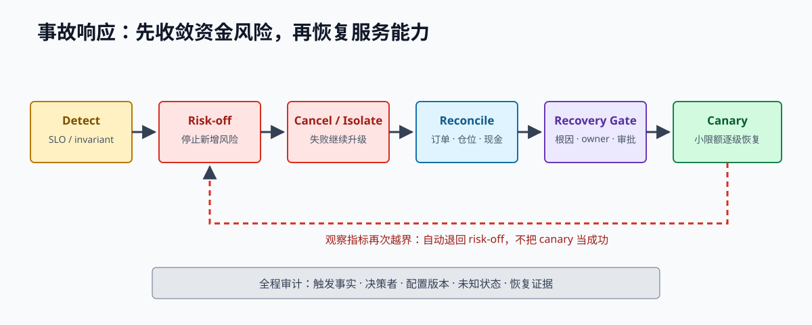

# 第 26 章 低延迟与生产可靠性

生产可靠性不是让程序永远不退出，而是让资金风险在故障中仍有明确上限，并让订单、成交和仓位能够恢复与审计。低延迟也不是孤立目标；它服务于减少过期报价、改善排队位置和更快地控制风险。

> **学习导航**
>
> - 开始前：已经理解实时处理、订单、风控、回放和研究验证。
> - 这一章学会：让系统在故障中限制风险，并依靠证据恢复。
> - 大约需要：16–22 小时。
> - 做完留下：处置手册、容量曲线、故障演练和恢复审批记录。

> **开章场景：监控全是绿色，系统仍在用旧价格交易**
>
> 剧烈波动时，行情处理开始积压。进程没有退出，网络端口能访问，CPU 也没有满，所以普通健康检查一直显示绿色；但策略看到的价格已经落后市场 6 秒，旧报价仍留在交易所。等到成交回报回来，仓位早已超过正常范围。
>
> 生产可靠性不仅检查程序是否活着，还要判断行情、订单、仓位和风险状态是否足以继续交易。**本章要解决的是：怎样发现这种部分失效，及时限制风险，并在对账和审批完成后有证据地恢复。**

> **第一次阅读建议**
>
> 先读 26.1 至 26.5 和 26.9 至 26.11，理解“怎样失败、怎样发现、怎样限制风险、怎样恢复”。底层性能指标、跨机器追踪和容量测试适合第二次结合实际部署环境阅读。

## 26.1 先列出每个部分会怎样失败

故障模型（failure model）是一张系统性清单。对每个组件都回答：

- 它可能停止、变慢、重复、乱序还是返回错误数据？
- 系统如何检测，检测时间多长？
- 自动动作是什么，最大暴露是多少？
- 状态恢复需要哪些事实？
- 由谁负责，处置手册是什么，什么情况下要通知更高级别人员？

至少覆盖网络部分失败、交易所部分失败、时钟异常、CPU/内存/磁盘过载、配置错误、凭证问题和外部依赖异常。

## 26.2 程序活着只是第一层状态

```text
程序进程活着
  -> 外部依赖可用
  -> 公开行情已经同步
  -> 私有订单和账户状态已经对账
  -> 风险状态有效
  -> 允许交易
```

每一级都要能独立观察。容器平台显示“就绪”或健康接口返回 HTTP 200，都不应自动打开交易。启用交易必须是一次明确、留下审计记录的状态变化。

建议分别为每家交易所、每个产品和每个策略维护状态：

- `Healthy`（健康）：满足增加风险的全部条件。
- `Degraded`（降级）：限制订单数量或功能，但仍保留受控能力。
- `RiskOff`：禁止增险，处理撤单、成交与对账。
- `Halted`（停止）：自动操作能力不足，需要人工接管。

## 26.3 服务目标必须对应资金风险

服务水平目标（SLO）规定系统在多大比例的时间内应达到某个可测标准。交易系统不能只看网页或接口是否可访问，还要监控以下内容：

行情：

- 订单簿有效且新鲜的时间比例。
- 发现序号缺口后恢复同步需要多久。
- 从收到原始消息到更新订单簿的延迟，以及队列消息年龄的多个分位数。

订单：

- 下单、确认、撤单和成交消息的网络往返时间。
- 拒单、未知订单和状态不确定订单的比例。
- 撤单等待时间与活动订单数量。

风险与账务：

- 仓位、总风险、净风险和活动订单可能带来的风险。
- 对冲延迟、保证金缓冲和距离限额还有多远。
- 订单、仓位和余额差异，以及完成对账需要多久。
- 已实现与未实现盈亏、费用、资金费和最大回撤。

每项目标都必须附带“超限后自动做什么”。只有监控面板而没有风险动作，不构成完整控制。

## 26.4 结构化日志与因果

日志记录：

- 用于串起同一次操作的关联编号，以及交易所、账户和产品。
- 配置、策略、适配器和消息格式版本。
- 订单簿序号、公允价、风险快照和原因代码。
- 原始消息在受控存储中的位置，而不是到处复制敏感内容。

不要只靠日历时间排列并发事件，因为机器校时和并发执行都会造成模糊。还要保留交易所序号、各组件单调递增的本地序号和因果关联编号。具体订单编号放入日志和请求追踪，监控指标只使用数量有限的分类标签，避免过多标签组合拖垮监控系统。

## 26.5 告警要能行动

每条告警都应写明负责人、严重程度、资金影响、自动动作、人工步骤和恢复验证。示例：

```text
条件：行情年龄超过硬上限，并且策略仍在运行
自动：停止该产品新增风险，提交撤单，冻结新订单意图
人工：核对其他价格源、连接、更新序号和活动订单
恢复：新快照对齐 + 行情持续新鲜 + 订单完成对账 + 明确重新启用
```

可以结合持续时间、发生比例和多个信号减少无意义告警，但不能用静默处理掩盖风险。系统自动停止增险后仍需通知人员，因为撤单可能失败，已有仓位也仍然存在。

## 26.6 延迟和过载时先保护关键路径（进阶）

实时路径需要持续监控：

- 每个处理阶段的中位数、第 99 和第 99.9 百分位延迟。
- 异步事件循环落后多久，以及消息在队列中等待多久。
- 内存分配、垃圾回收（若有其他语言组件）和线程切换。
- CPU 饱和、虚拟机被其他任务抢占、跨内存节点访问和磁盘刷盘耗时。
- 网络数据包、错误、重传和交易所往返时间。

过载时依次考虑：减少非必要日志和查询，把可被新值完全替代的旧状态合并掉，降低报价更新频率，缩小订单或扩大报价距离，禁用部分产品，最后停止新增风险。不能牺牲订单和成交记录的可靠性来维持表面吞吐。

## 26.7 恢复要回答“多快”和“最多丢多少”

分别定义：

- **恢复时间目标（RTO）**：故障后多快恢复到风险可控的服务状态。
- **恢复点目标（RPO）**：崩溃时最多允许丢失多少本地审计数据。
- **交易就绪条件**：满足哪些证据后才允许重新增加风险。

交易就绪通常比“进程重新启动”严格得多。恢复时先加载最近一份有效状态快照，再重放后续事件日志，并与交易所活动订单、近期成交、仓位和余额对账。

事件日志和状态快照需要带消息格式版本、校验值和单调递增序号；新快照只有完整写入后才能替换旧快照。必须测试磁盘变慢、磁盘写满、只写入半条记录、内容损坏和读取旧格式等情况。

## 26.8 密钥、环境和资金要相互隔离

- API key 最小权限，交易 key 禁止提现。
- 生产环境、测试网、不同交易所和不同策略使用独立密钥或子账户。
- 配置网络地址允许名单、密钥轮换、访问审计和撤销流程。
- 密钥不进入代码、仓库、日志、崩溃转储和命令历史。
- 配置要经过格式校验、版本记录、审批、小范围试运行和回滚准备。
- 高风险限额变更使用双人复核。
- 紧急停止和管理端使用强认证、最小网络暴露和完整审计。
- 账户资金按策略风险隔离，避免单一错误使用全部抵押品。

启动日志和操作界面必须醒目显示环境，避免测试命令误发生产。

## 26.9 新版本要逐级扩大影响范围

```text
单元测试、规则测试和随机异常输入测试
-> 确定性历史回放
-> 适配器契约测试
-> 影子运行，不发真实订单
-> 测试网
-> 生产环境最小范围试运行
-> 逐步扩大
```

每一级都要定义进入条件、观察时间、指标门槛、回退条件和负责人。系统需要能够分别开关某家交易所、某个产品、某个策略、新订单、修改订单和主动对冲。回滚软件版本不能自动撤销已经存在于交易所的订单和仓位，外部状态必须另行处理。

## 26.10 事故前就设计好降级模式

降级设计应在事故前完成：

| 故障 | 自动动作候选 | 恢复条件 |
| --- | --- | --- |
| 单一行情源过期 | 扩大报价距离或停用该源，参考备用源 | 重新同步并持续稳定 |
| 私有消息过期 | 禁止增险并通过 HTTP 查询对账 | 缺口补齐，订单可以确认 |
| 对冲交易所失联 | 缩小挂单、撤单或降低仓位 | 对冲能力和持仓恢复 |
| 限流响应增加 | 降低改价频率，为撤单保留额度 | 剩余额度和拒单恢复正常 |
| 磁盘持久化变慢 | 停止创建新的增险订单意图 | 刷盘和审计记录恢复健康 |
| 仓位出现差异 | 停止增险并对账 | 差异得到解释，账本闭合 |

“继续服务”不是默认优先级。对资金系统，已知安全状态通常优于功能完整但事实未知。

## 26.11 事故响应



*图 26-1：恢复软件服务不等于恢复交易权限；对账、根因隔离和小范围恢复检查缺一不可。*

顺序：

1. 确认当前仓位、活动订单、状态未知订单、保证金与资产影响。
2. 限制新增风险，按能力撤单或降仓。
3. 保留原始证据，建立单一事实时间线。
4. 恢复到已知安全状态，不在未知状态中追求满服务。
5. 对账订单、成交、持仓、余额、交易费用、资金费用与盈亏。
6. 查明直接原因与系统性促成因素。
7. 为长期修复指定负责人、期限和验证方式。

“工程师操作失误”不能作为调查终点。还要追问：为什么一次操作能影响全部资金，为什么系统缺少校验、权限隔离、小范围试运行、审批或回滚保护。

## 26.12 事故文档

```markdown
# 事故：标题

## 影响
- 资金、仓位、交易与时间范围：

## 时间线
- 时间、事实、来源与不确定性：

## 发现与响应
- 如何发现、为何未更早发现：
- 自动/人工风险动作及结果：

## 根本原因
- 直接技术原因：
- 系统性促成因素：

## 对账
- 订单、成交、持仓、现金和 PnL 是否闭合：

## 后续行动
- action、owner、期限、验证方法：
```

事实、推断和未知要分开写。事故时间线中的每个关键点尽量引用日志、原始消息或交易所查询证据。

## 26.13 必做故障演练

- 丢失一条二档订单簿增量后仍继续收到消息。
- TCP 活着但 5 秒无有效行情。
- 私有消息流断开，期间发生成交。
- 下单已经到达交易所，但响应超时。
- 撤单确认丢失，同时发生最终成交。
- HTTP 429 限流导致紧急撤单额度不足。
- CPU 饱和导致消息在队列中等待过久。
- 磁盘变慢或写满，导致订单意图无法可靠保存。
- 进程在发送请求与保存确认之间被强制终止。
- 配置把最大订单放大 1000 倍。
- 挂单交易所或对冲交易所局部停机。
- 本地持仓少一笔成交。

每项演练都要记录发现问题的指标、自动动作、人工处置步骤、最坏风险和恢复验证。

## 26.14 从可承受风险倒推服务目标

假设正常市场下，99% 的撤单网络往返在 40 毫秒内完成，订单簿通常每 10 毫秒更新一次，策略预测优势大约持续 150 毫秒。不能因此直接规定“行情只要不超过 150 毫秒就算新鲜”，因为发现问题、作出决定、发送和撤单也需要时间。

例如：

```text
最大允许使用错误价格的时间   150 ms
发现行情过期并调度处理        20 ms
风控和决策                    10 ms
撤单发送到真正生效            60 ms（压力情景预算）
安全余量                      30 ms
留给行情本身的最大年龄        30 ms
```

如果现实中行情年龄经常超过 30 毫秒，不能只把告警门槛放宽到 200 毫秒。这说明策略预测周期、部署位置、数据源或报价方式彼此不匹配。服务目标的作用，是把市场假设转化成工程约束。

同样，仓位每 5 分钟对账一次是否足够，取决于多久能发现私有消息缺失、最大下单速度和账户限额。每项服务目标都应能追溯到一个具体风险情景。

## 26.15 指标、日志和调用链各自回答什么

同一个未知订单事件，在三种可观测数据中表达不同：

**指标（metric）**用于发现趋势和触发告警：

```text
orders_uncertain{venue="A", strategy="mm", reason="send_timeout"} 1
```

指标标签只使用数量有限的分类，不放具体订单编号。

**结构化日志（structured log）**用于查询一张具体订单的事实：

```json
{
  "event": "order_uncertain",
  "client_order_id": "...",
  "venue": "A",
  "instrument": "BTC-PERP",
  "reason": "send_timeout",
  "config_version": 42
}
```

**调用链追踪（trace）**把策略决定、风控检查、持久化、发送和查询串成一条因果链。原始请求与响应保存在受控存储中，通过校验值和引用位置关联。

只靠日志监控趋势会很昂贵，也难以稳定聚合；只靠指标无法还原一张订单；抽样保存的调用链又不能替代完整资金审计事件日志。

## 26.16 一次部分故障时间线

```text
12:00:00.000  私有消息流最后一条有效事件
12:00:00.600  网络心跳仍正常，但业务消息已经过期
12:00:00.620  系统停止增险，不再新建或扩大订单，并发出撤单
12:00:00.670  开始通过 HTTP 查询活动订单
12:00:00.710  挂单在交易所成交，但私有流没有报告
12:00:00.900  活动订单查询显示订单已经消失
12:00:01.050  近期成交查询发现这笔成交
12:00:01.060  成交防重入账，仓位和风险状态更新
12:00:01.120  对冲规则执行受控降险
12:00:02.000  私有消息流重连，但继续保持停止增险
12:00:02.400  补齐消息缺口，完成订单、仓位和余额对账
12:00:05.000  人工批准小范围恢复
```

这条时间线说明：网络心跳不能代替业务消息新鲜度，活动订单从查询中消失也不能证明它已撤销，重连更不等于恢复交易。若系统在 `12:00:00.620` 只重启连接却继续报价，未知仓位会继续扩大。

## 26.17 容量测试要同时看速度和长时间稳定性

容量测试不能只在几秒内把吞吐推到最大。还要进行长时间稳定性测试（soak test），至少包含：

- 正常率持续数小时，检查内存、句柄和状态漂移。
- 历史极端窗口按 1x/2x/5x 回放。
- 获取快照、重连和日志突增与高消息率同时发生。
- 私有订单与成交高峰和公开行情高峰同时发生。
- 磁盘刷盘、指标存储或域名解析等依赖变慢。

记录系统怎样逐步变慢，而不只寻找一个“最终崩溃点”。例如从正常峰值的 1.5 倍开始，队列消息年龄快速上升；2 倍时风险动作仍能及时执行；2.5 倍时撤单被普通查询阻塞。这些观察会直接决定安全容量和优先级队列设计。

生产限额应低于实验极限，并为故障处理留出余量。正常峰值刚好占满 CPU 的系统，没有空间处理重新同步、对账和告警。

## 26.18 恢复审批

事故后恢复不能只是把 `enabled=true` 改回去。审批前确认：

1. 当前订单、执行、仓位、余额与权益已经对账。
2. 根因已隔离，临时缓解对目标范围有效。
3. 行情和私有状态在观察窗口内持续健康。
4. 限额已经降到最小试运行水平，负责人和回退条件明确。
5. 告警、监控面板和人工操作通道可用。
6. 恢复动作本身写入审计，记录批准人与配置版本。

恢复后重点观察那些会在事故前率先恶化的指标，不能只看盈亏。影响范围要逐步扩大，每一级都重新确认。

## 26.19 本章完成标准

- 进程健康与交易就绪状态分开。
- 每个服务目标超限都有对应资金风险动作。
- 关键状态可从事件日志重放，并与交易所记录对账。
- 发布可逐级扩大，软件回滚同时处理外部订单/仓位。
- 密钥、配置、紧急停止和资产具有最小权限边界。
- 至少完成一次有时间线和账务对账的故障演练。

生产工程的最终问题不是“系统会不会失败”，而是“失败时损失是否有上界，事实是否能恢复，下一次是否更难发生”。

## 26.20 回顾与进入检查点

生产可靠性从故障模型开始：组件可能怎样停止、变慢、重复、乱序或输出错误状态，系统多久能够发现，自动动作怎样限制风险，恢复需要哪些事实。程序活着、依赖可用、行情已同步、私有状态已对账、风险有效和允许交易，必须逐层区分。

服务目标要连接资金风险，告警要包含负责人和动作，结构化日志、指标和调用链追踪各自提供能够关联的证据。发布从离线测试、影子运行、测试网到小范围生产逐级扩大；降级或停止增险时仍要继续处理成交、撤单和对账。软件回滚也不能忘记新版本已经在交易所创建的订单和仓位。

现在进入[阶段检查点五](gate-5-research-production.md)。你将同时展示可确定回放、成交敏感性、样本外研究和一次生产式故障恢复，证明研究与运行共享同一套领域事实。
